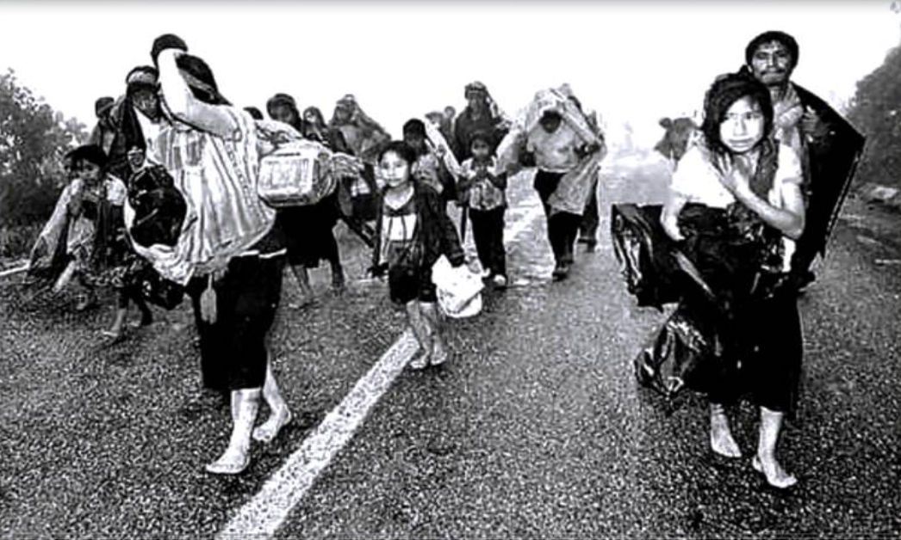

#Programa para el Desarrollo
- - - - - - - - - - - - - - - - - - - - - - - - - - - - - - - - - - -

##Detalles del Proyecto
| Descripción         | Detalle   |
|:--------------------|:---------:|
| Nombre del proyecto | Programa para el Desarrollo |
| Donante             | 400,000 € |
| Presupuesto total   | Gobierno de Holanda |
| Años de ejecución   | 1997 - 2000 |
| Tiempo de ejecución | 3 años |

En el año 1997 la Cruz Roja Holandesa inicia su apoyo a Cruz Roja Guatemalteca en el Departamento de Alta Verapaz en Guatemala. Durante 3 años, de 1997 al 2000, el programa "Desarrollo Humano" financiado por el Gobierno de Holanda, con un enfoque integrado con iniciativas de educación para la salud y desarrollo comunitario, estuvo destinado en ayudar a la población desplazada que iba retornado como resultado de los Acuerdos de Paz firmados.
 
Es a partir de esta primera intervención que la Cruz Roja Holandesa ha venido apoyando técnica y financieramente, de forma  ininterrumpida, a Cruz Roja Guatemalteca por un total de 18 años, de 1997 a 2015.

##Ubicación
[gimmick:googlemaps(zoom: 9, marker: 'true')](Cobán, Alta Verapaz)
###Departamento
* Alta Verapaz
####Municipio
* Cobán

- - - - - - - - - - - - - - - - - - - - - - - - - - - - - - - - - - -

[p01]: proyectos/p01.md	"Programa para el Desarrollo"
[p02]: proyectos/p02.md	"Cooperación Holandesa para Ayuda en Centroamérica -CHACA-"
[p03]: proyectos/p03.md	"Atención a la salud preventiva, agua y saneamiento en 12 comunidades de Alta Verapaz, Guatemala"
[p04]: proyectos/p04.md	"Fortalecimiento de las Capacidades para la mitigación de desastres en el Municipio de Cobán y 30 comunidades de la cuenca del Río Chixoy"
[p05]: proyectos/p05.md	"Reduciendo los Riesgos en Comunidades Vulnerables del  Municipio de Santo Domingo, Departamento de Suchitepéquez, Guatemala"
[p06]: proyectos/p06.md	"Fortaleciendo capacidades ante los riesgos de Cambio Climático en el Oriente de Guatemala"
[p07]: proyectos/p07.md	"Reducción de Vulnerabilidades ante los efectos del Cambio Climático en Guatemala, Fase II"
[p08]: proyectos/p08.md	"Trabajando juntos podemos reducir los riesgos en las comunidades vulnerables de Champerico y Retalhuleu, Guatemala"
[p09]: proyectos/p09.md	"Respuesta inmediata ante las inundaciones provocadas por la Tormenta AGATHA, en la región suroccidente de Guatemala"
[p10]: proyectos/p10.md	"Fortaleciendo la Resiliencia de las comunidades ante los efectos de los desastres en parcelamiento La Máquina, Suchitepéquez y Retalhuleu"
[p11]: proyectos/p11.md	"Reducción del riesgo de desastres incrementados por el Cambio Climático"
[p12]: proyectos/p12.md	"Respuesta Inmediata a los efectos de los sismos en el departamento de Santa Rosa, Guatemala"
[p13]: proyectos/p13.md	"Aumentando la resiliencia ante los desastres en el departamento del Peten, Guatemala"
[p14]: proyectos/p14.md	"Mejorando la Salud Materno Neonatal de Comunidades Vulnerables de San Marcos, Guatemala"

