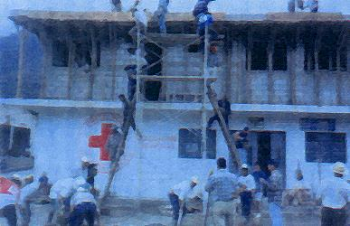

#Cooperación Holandesa para Ayuda en Centroamérica - CHACA -
- - - - - - - - - - - - - - - - - - - - - - - - - - - - - - - - - - -

##Detalles del Proyecto
| Descripción         | Detalle                                                     |
|:--------------------|:-----------------------------------------------------------:|
| Nombre del proyecto | Cooperación Holandesa para Ayuda en Centroamérica - CHACA - |
| Donante             | Gobierno de Holanda |
| Socios Nacionales   | Proyecto regional (Honduras/Guatemala/Nicaragua) |
| Presupuesto total   | 1,177,868.85 € |
| Años de ejecución   | 1999 – 2002 |
| Tiempo de ejecución | 3.5 años (01/01/1999 al 01/06/2002) |

A finales de Octubre de 1998, América Central fue afectada por el paso del huracán MITCH, provocando pérdidas humanas, económicas y daños a la infraestructura en general y de cultivos, en los países de Honduras, Nicaragua y Guatemala. La Cruz Roja Holandesa respondiendo al llamamiento internacional de ayuda realizado por la Cruz Roja de los países centroamericanos, envió en diciembre de 1998 una misión para identificar los daños causados por el Huracán Mitch, dando como resultado el diseño e implementación del programa bilateral Cooperación Holandesa para ayudar a Centroamérica (Programa CHACA) con una duración de tres años, con un plan de acción con diversos componentes, basados en el Desarrollo Comunitario y la participación activa de los damnificados.

Como resultado 17 comunidades de Cobán con 772 familias (4,627 personas) y 17 comunidades de Petén con 900 familias (5,733 personas) fueron beneficiarias, participando de forma directa en la construcción de nuevos sistemas de agua y saneamiento (pozos con bombas manuales, instalación de sistemas de aljibes, sistema de agua potable, letrinas), en la rehabilitación y construcción de servicios sociales (puentes peatonales colgantes, construcción y equipamiento de escuelas y trojas de su comunidad), con micro-proyectos productivos y de generación de empleo (huertos familiares, molinos de nixtamal, teléfono comunitario, dotación de semilla mejorada de maíz y crédito mínimo, etc).

La atención en salud primaria, la construcción y equipamiento de unidades mínimas, las capacitaciones en preparación a desastres y educación comunitaria en primeros auxilios, entre otras actividades, conformaron el enfoque integral del proyecto.

Por último, el proyecto fortaleció a la Cruz Roja Guatemalteca en las Delegaciones donde se ejecutó en actividades de construcción y dotación de equipo, con el fin de adecuar su participación e implementación del proyecto.

##Ubicación
[gimmick:googlemaps(zoom: 8, marker: 'true')](La Libertad, Petén)
[gimmick:googlemaps(zoom: 8, marker: 'true')](Cobán, Alta Verapaz)
###Departamentos:
* Alta Verapaz
* Petén
####Municipios:
* La Libertad (Petén)
* Sayaxché (Petén)
* Chisec (Alta Verapaz)
* Cobán (Alta Verapaz)

##Objetivos

###Objetivo General
Rehabilitar y reconstruir la infraestructura de vivienda, servicios comunitarios, actividades económicas y de empleo, y servicios de salud y educación de las comunidades afectadas por el Huracán Mitch en los departamentos de Alta Verapaz y El Petén de Guatemala, mediante el apoyo y acción directa de la sede central y las  delegaciónes de la CRG.

###Objetivo Específico
1. Rehabilitación y reconstrucción comunitaria basada en la participación activa de la comunidad y el desarrollo sostenible
2. Preparación y respuesta a desastres de las comunidades y las cruces rojas
3. Desarrollo institucional de las delegaciones y sedes de la Cruz Roja para garantizar la ejecución del programa y para asegurar la respuesta a los desastres y las necesidades.

##Beneficiarios
| Descripción                     | Detalle       |
|:--------------------------------|:-------------:|
| N° beneficiarios                | 1672 Familias |
| N° de comunidades beneficiarias | 34            |
| Etnia                           | Q'eqchi'      |

##Documentos
###Informes
####Final

<a class="descarga-pdf" href="p02-chaca/2-informes/informe_final.mp4">Descargar MP4</a>

##Fotos
- - -

####SD

- - - - - - - - - - - - - - - - - - - - - - - - - - - - - - - - - - -

[p01]: proyectos/p01.md	"Programa para el Desarrollo"
[p02]: proyectos/p02.md	"Cooperación Holandesa para Ayuda en Centroamérica -CHACA-"
[p03]: proyectos/p03.md	"Atención a la salud preventiva, agua y saneamiento en 12 comunidades de Alta Verapaz, Guatemala"
[p04]: proyectos/p04.md	"Fortalecimiento de las Capacidades para la mitigación de desastres en el Municipio de Cobán y 30 comunidades de la cuenca del Río Chixoy"
[p05]: proyectos/p05.md	"Reduciendo los Riesgos en Comunidades Vulnerables del  Municipio de Santo Domingo, Departamento de Suchitepéquez, Guatemala"
[p06]: proyectos/p06.md	"Fortaleciendo capacidades ante los riesgos de Cambio Climático en el Oriente de Guatemala"
[p07]: proyectos/p07.md	"Reducción de Vulnerabilidades ante los efectos del Cambio Climático en Guatemala, Fase II"
[p08]: proyectos/p08.md	"Trabajando juntos podemos reducir los riesgos en las comunidades vulnerables de Champerico y Retalhuleu, Guatemala"
[p09]: proyectos/p09.md	"Respuesta inmediata ante las inundaciones provocadas por la Tormenta AGATHA, en la región suroccidente de Guatemala"
[p10]: proyectos/p10.md	"Fortaleciendo la Resiliencia de las comunidades ante los efectos de los desastres en parcelamiento La Máquina, Suchitepéquez y Retalhuleu"
[p11]: proyectos/p11.md	"Reducción del riesgo de desastres incrementados por el Cambio Climático"
[p12]: proyectos/p12.md	"Respuesta Inmediata a los efectos de los sismos en el departamento de Santa Rosa, Guatemala"
[p13]: proyectos/p13.md	"Aumentando la resiliencia ante los desastres en el departamento del Peten, Guatemala"
[p14]: proyectos/p14.md	"Mejorando la Salud Materno Neonatal de Comunidades Vulnerables de San Marcos, Guatemala"

