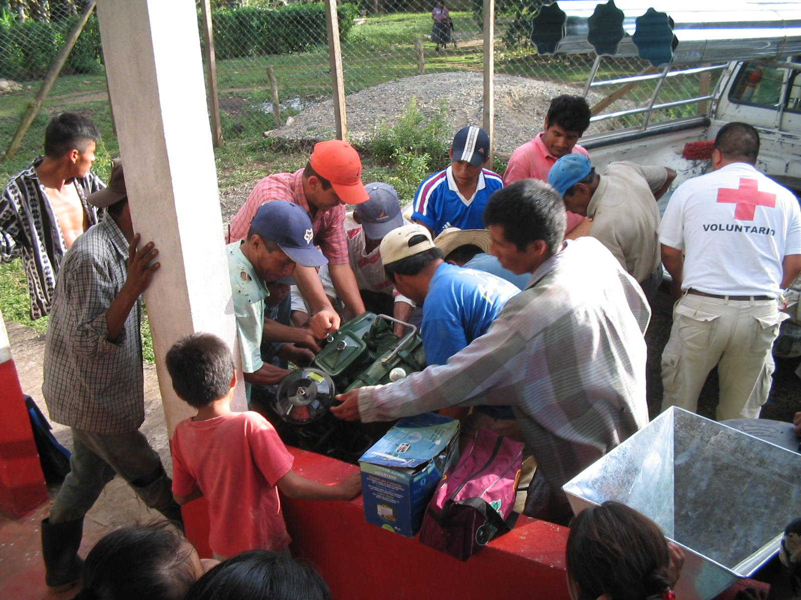
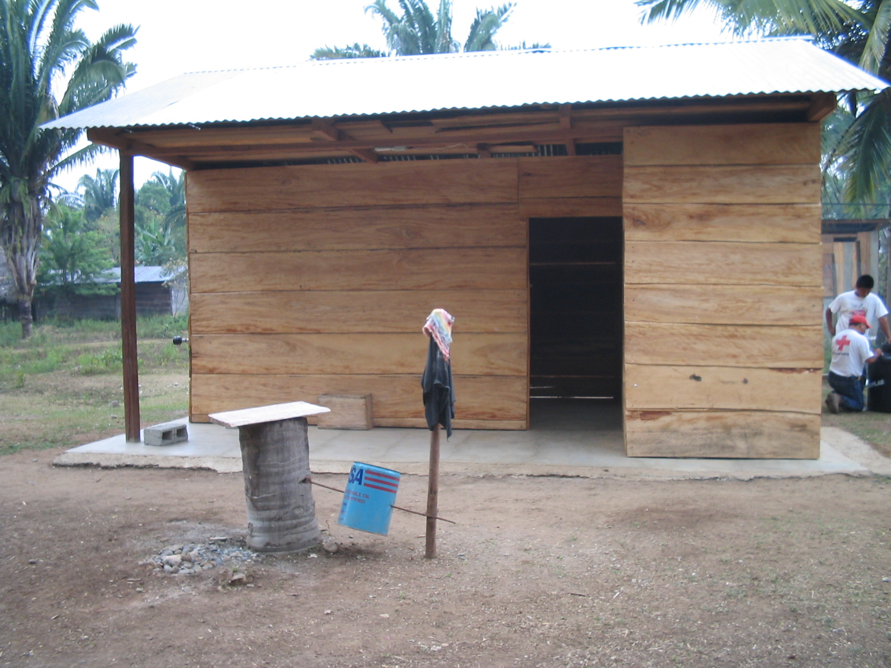

#PRRAC-USI HA
- - - - - - - - - - - - - - - - - - - - - - - - - - - - - - - - - - -

##Detalles del Proyecto
| Descripción         | Detalle   |
|:--------------------|:---------:|
| Nombre del proyecto | Atención a la salud preventiva, agua y saneamiento en 12 comunidades de Alta Verapaz, Guatemala  |
| Donante             | Comisión Europea, Programa Regional de para América Latina- PRRAC |
| Presupuesto total   | 588,684.98€ |
| Año de ejecución    | 2003 - 2005 |
| Tiempo de ejecución |  28 meses y 14 días (18/04/2003 al 31/08/2005) |

##Antecedentes
El proyecto "USI HÁ" (que en lengua K'ekchi, "significa agua limpia") tuvo como objetivo la atención en salud preventiva, agua y saneamiento en 12 Comunidades en el Departamento de Alta Verapaz, Guatemala. De las 17 comunidades atendidas por el Programa CHACA resultaron elegidas en el proceso de selección 12, dando así continuidad al proceso de desarrollo realizado por Cruz Roja Guatemalteca con el apoyo de Cruz Roja Holandesa en esta área del país.

El objetivo global del proyecto fue mejorar las condiciones sanitarias y ambientales de estas comunidades, con énfasis en niñas y niños menores de 5 años así como mujeres, reduciendo la incidencia de enfermedades prevenibles. Se usó estrategias de Información, Educación y Capacitación (lEC) con mensajes precisos en temas de salud, generando cambios que pretendieron romper con los ciclos permanentes y generacionales de reproducción de condiciones de salud. El proyecto apoyó a su vez con sistemas de almacenamiento de agua alternativos (aljibes), con la construcción de letrinas aboneras y equipando a las Unidades Mínimas de Atención comunitaria en salud, entre otras actividades. A su vez, por tratarse de comunidades ubicadas en zonas de riesgo, se fortaleció la Coordinadora Local para la Reducción de Desastres (COLRED).

Por último, la Cruz Roja Guatemalteca y su delegación se fortalecieron en su capacidad de respuesta y la imagen en las comunidades.

##Ubicación
[gimmick:googlemaps(zoom: 9, marker: 'true')](Alta Verapaz, Guatemala)
###Departamento
* Alta Verapaz
####Municipios
* Chisec
* Cobán

##Objetivos

###Objetivo General
Contribuir a la mejora de las condiciones sanitarias y ambientales en 12 comunidades del departamento de Alta Verapaz, Guatemala.

###Objetivos Específicos
1. Mejorar las condiciones de salud y saneamiento básico de las personas beneficiadas del proyecto a través de la educación y el uso de tecnología apropiada, para disminuir la incidencia de las enfermedades producidas por el manejo del agua para consumo humano, basura, excretas y aguas residuales.
2. Fortalecer la capacidad de respuesta de las comunidades ante los desastres naturales mediante el seguimiento y asistencia técnica a los planes de trabajo de la organización comunitaria para la atención de los desastres, Coordinadores Locales para la Reducción de Desastres (COLRED).

##Actividades núcleos
* Construcción y mejoramiento de Infraestructura:
  * Letrinas aboneras
  * Aljibes (Sistemas de cosecha de agua de lluvia)
  * Sistema de Abastecimiento de Agua Alternativa (Llena cántaro)
  * Unidades Mínimas
  * Mejoras a los edificios escolares
  * Una escuela primaria
  * Parques Infantiles
  * Molinos nixtamales

* Capacitaciones relacionadas a:
  * PHAST (Programa Transformación Participativa para la Higiene y el Saneamiento)
  * Agua y Saneamiento
  * Primeros auxilios
  * Prevención y Mitigación de desastres - simulacros
  * Construcción, uso y mantenimiento de Letrinas Aboneras y Aljibes
  * Organización Comunitaria
  * Fortalecimiento de las COLRED
  * Jornadas de limpieza

* Establecer planes comunales relacionados a:
  * Plan de funcionamiento COLRED
  * Plan de emergencia escolar
  * Plan de emergencia comunal
  * Plan de funcionamiento de las Unidades Mínimas

##Beneficiarios
| Descripción                     | Detalle |
|:--------------------------------|:-------:|
| N° beneficiarios directos       | 3,957 personas / 574 familias |
| N° beneficiarios indirectos     | 251224 |
| N° de comunidades beneficiarias | 12	|
| Etnia                           | Q'eqchi' y Pocomchi' |

##Documentos

###Propuesta
####Proyecto

<a class="descarga-pdf" href="p03-usiha/1-propuesta/proyecto_usi_ha.pdf">Descargar</a>

####Marco Lógico

<a class="descarga-pdf" href="p03-usiha/1-propuesta/marco_logico-usi_ha.pdf">Descargar</a>

####Convenio de financiación CRH/CE

<a class="descarga-pdf" href="p03-usiha/1-propuesta/convenio_financiacion_crh_ce.pdf">Descargar</a>

###Informes

#####Lecciones Aprendidas

<a class="descarga-pdf" href="p03-usiha/2-informes/informe_lecciones_aprendidas_proyecto_usi_ha.pdf">Descargar</a>

#####Informe Final Narrativo

<a class="descarga-pdf" href="p03-usiha/2-informes/informe_final_narrativo-usi_ha.pdf">Descargar</a>

###Evaluaciones
#####TDR Auditoría

<a class="descarga-pdf" href="p03-usiha/3-evaluaciones/tdr_auditoria.pdf">Descargar</a>

#####Comparación empresas auditoras

<a class="descarga-pdf" href="p03-usiha/3-evaluaciones/comparacion_empresas_auditoras.pdf">Descargar</a>

#####Actividades para Niños y Niñas

<a class="descarga-pdf" href="p03-usiha/3-evaluaciones/evalaucion_actividades_ninos-as.pdf">Descargar</a>

###Sistematizaciónes

<a class="descarga-pdf" href="p03-usiha/4-sistematizaciones/resultados_sistematizacion_capacitaciones-usi_ha.pdf">Descargar</a>

###Herramientas
####Afiches Aljibes

<a class="descarga-pdf" href="p03-usiha/5-herramientas/afiche-aljibes.pdf">Descargar</a>

####Afiches Desastres

<a class="descarga-pdf" href="p03-usiha/5-herramientas/afiche-desastres.pdf">Descargar</a>

####Afiches Letrinas

<a class="descarga-pdf" href="p03-usiha/5-herramientas/afiche-letrinas.pdf">Descargar</a>

####Afiches Principios CR

<a class="descarga-pdf" href="p03-usiha/5-herramientas/afiche-principios.pdf">Descargar</a>

####Rotafolio Agua

<a class="descarga-pdf" href="p03-usiha/5-herramientas/rotafolio-agua.pdf">Descargar</a>

####Rotafolio Desastres

<a class="descarga-pdf" href="p03-usiha/5-herramientas/rotafolio-desastres.pdf">Descargar</a>

####Rotafolio Letrina

<a class="descarga-pdf" href="p03-usiha/5-herramientas/rotafolio-letrina.pdf">Descargar</a>

##Fotos

###SD

- - -

###HD

- - -

##Videos

[Descargar MP4](p03-usiha/7-videos/usi-ha_14.mp4 "Video 14 Proyecto Usi Ha'") | [Descargar WEBM](p03-usiha/7-videos/usi-ha_14.webm "Video 14 Proyecto Usi Ha'")

[Descargar MP4](p03-usiha/7-videos/usi-ha_15.mp4 "Video 15 Proyecto Usi Ha'") | [Descargar WEBM](p03-usiha/7-videos/usi-ha_15.webm "Video 15 Proyecto Usi Ha'")

[Descargar MP4](p03-usiha/7-videos/usi-ha_17.mp4 "Video 17 Proyecto Usi Ha'") | [Descargar WEBM](p03-usiha/7-videos/usi-ha_17.webm "Video 17 Proyecto Usi Ha'")

[Descargar MP4](p03-usiha/7-videos/usi-ha_18.mp4 "Video 18 Proyecto Usi Ha'") | [Descargar WEBM](p03-usiha/7-videos/usi-ha_18.webm "Video 18 Proyecto Usi Ha'")

[Descargar MP4](p03-usiha/7-videos/usi-ha_19.mp4 "Video 19 Proyecto Usi Ha'") | [Descargar WEBM](p03-usiha/7-videos/usi-ha_19.webm "Video 19 Proyecto Usi Ha'")

- - - - - - - - - - - - - - - - - - - - - - - - - - - - - - - - - - -

