#DIPECHO V
- - - - - - - - - - - - - - - - - - - - - - - - - - - - - - - - - - -

##Detalles del Proyecto
| Descripción         | Detalle   |
|:--------------------|:---------:|
| Nombre del proyecto | Reduciendo los Riesgos en Comunidades Vulnerables del  Municipio de Santo Domingo, Departamento de Suchitepéquez, Guatemala |
| Donante             | ECHO |
| Presupuesto total   | 396,767.00€ |
| Año de ejecución    | 2007 - 2008 |
| Tiempo de ejecución | 15 meses (01/02/2007 al 30/04/2008) |

El Proyecto Reduciendo los  Riesgos en Comunidades Vulnerables de Santo Domingo Suchitepéquez, se ejecutó de febrero del año 2007 a junio del año 2008,  en 18 comunidades en la región VI Sur Occidente de Guatemala, afectadas por el Huracán Stan y con una alta vulnerabilidad y riesgo hidrometeorológico, agravado por la falta de preparación, atención y mitigación frente a las emergencias y desastres por las estructuras municipales y comunales existentes. La Cruz Roja Guatemalteca, a través de su Delegación de Mazatenango, coordinó el proyecto con el apoyo técnico y financiero de la Cruz Roja Holandesa, la Cruz Roja Española y la Dirección General de Ayuda Humanitaria de la Comisión Europea (ECHO/DIPECHO). También se contó con la  participación de la Delegación Regional de la Región VI de la Secretaria Ejecutiva de la Coordinadora Nacional para la Reducción de Desastres (CONRED), la Coordinadora Departamental para la Reducción de Desastres y  la Coordinadora Municipal para la Reducción de Desastres (COMRED) de Suchitepéquez.

##Ubicación
[gimmick:googlemaps(zoom: 10, marker: 'true')](Santo Domingo Suchitepéquez, Suchitepéquez)
###Departamento
* Suchitepéquez
####Municipio
* Santo Domingo

##Objetivos

###Objetivo General
Reducir los riesgos ante desastres, preparando la población vulnerable en las áreas más expuestas a los desastres naturales.

###Objetivo Específico
1. Fortalecido el Sistema de Reducción de Desastres a nivel regional y nacional, a través del mejoramiento de las capacidades organizativas, de preparación y respuesta en 18 comunidades del Municipio de Santo Domingo Suchitepéquez.

##Beneficiarios
| Descripción                     | Detalle |
|:--------------------------------|:-------:|
| N° beneficiarios directos       | 13,260 |
| N° beneficiarios indirectos     | 32,202 |
| % hombres                       | 49.78% |
| % mujeres                       | 50.22% |
| N° de comunidades beneficiarias | 18	|
| Etnia                           | Mestizos, Kakchikel, Quiche' y  Mam |

##Documentos
###Propuesta

<a class="descarga-pdf" href="p05-dipecho5/1-propuesta/propuesta_dipecho_5.pdf">Descargar</a>

###Informes
####Final

<a class="descarga-pdf" href="p05-dipecho5/2-informes/informe_final.pdf">Descargar</a>

###Sistematizaciónes

<a class="descarga-pdf" href="p05-dipecho5/4-sistematizaciones/presentacion_sistematizaci%C3%B3n_dipecho_v.pdf">Descargar</a>

###Herramientas
####Afiche Comite Escolar

<a class="descarga-pdf" href="p05-dipecho5/5-herramientas/afiche_comite_escolar.pdf">Descargar</a>

####Riesgolandia

<a class="descarga-pdf" href="p05-dipecho5/5-herramientas/riesgolandia.pdf">Descargar</a>

####Rotafolio manejo desastres

<a class="descarga-pdf" href="p05-dipecho5/5-herramientas/rotafolio_manejo_desastres.pdf">Descargar</a>

##Fotos

###SD

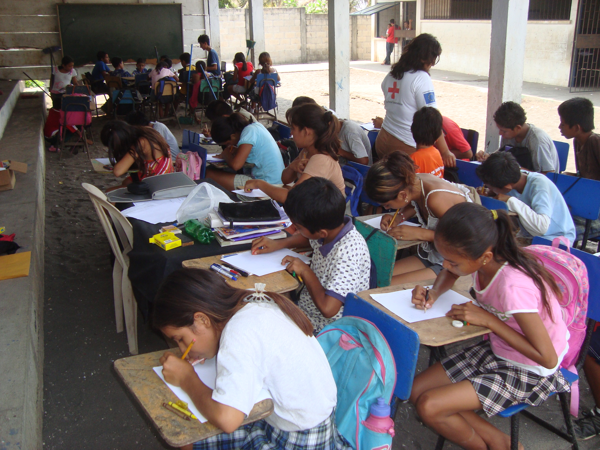

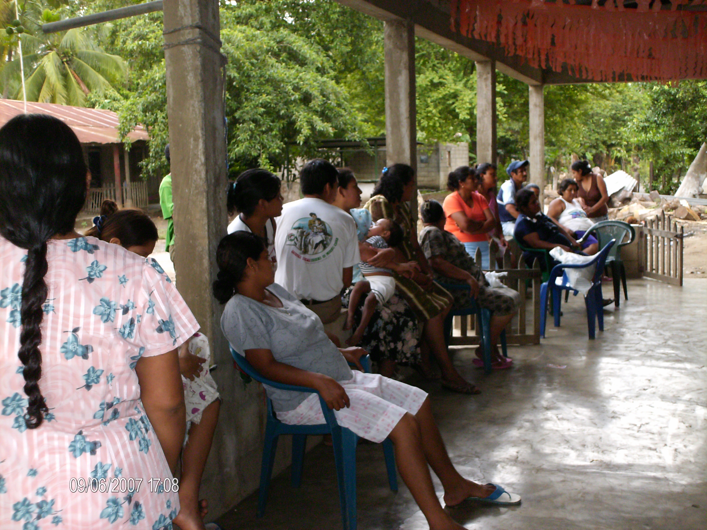

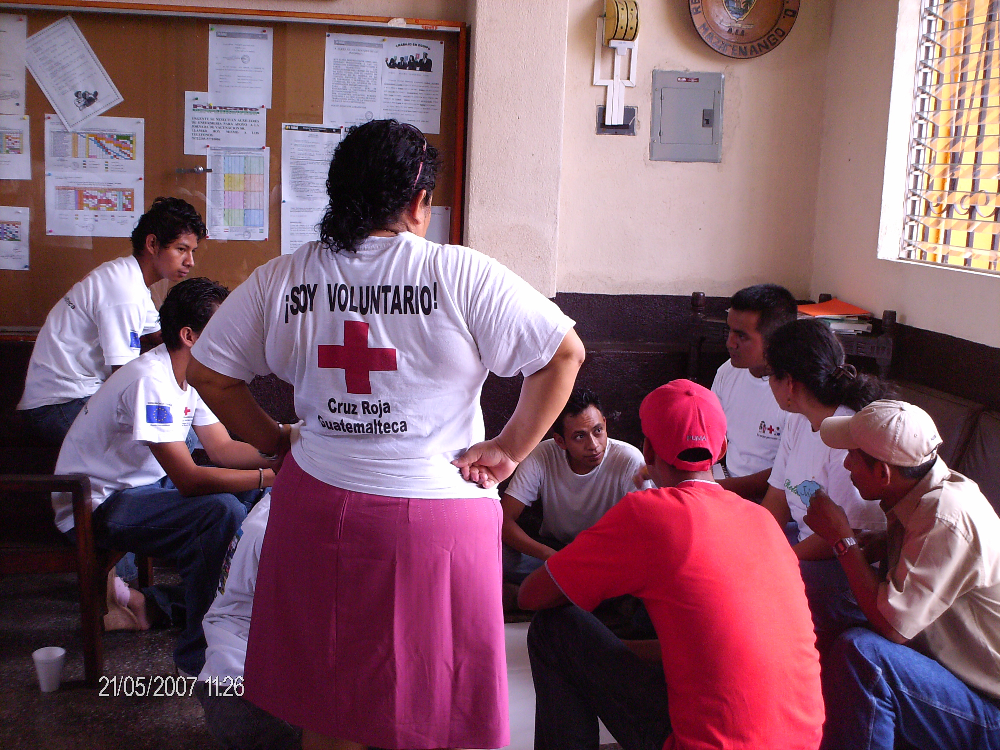

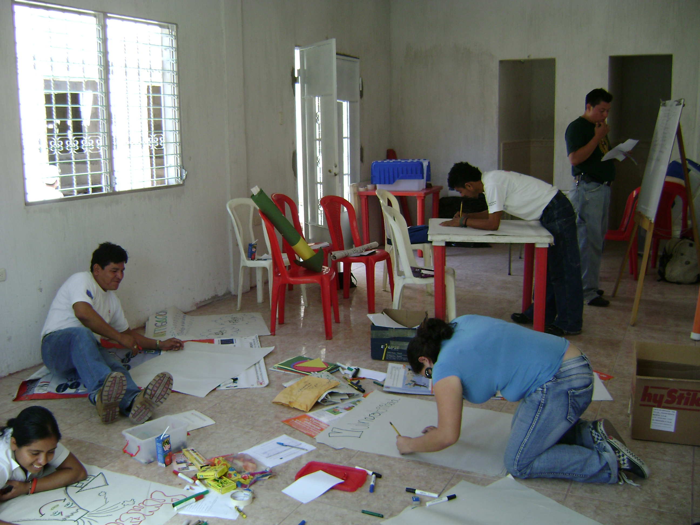

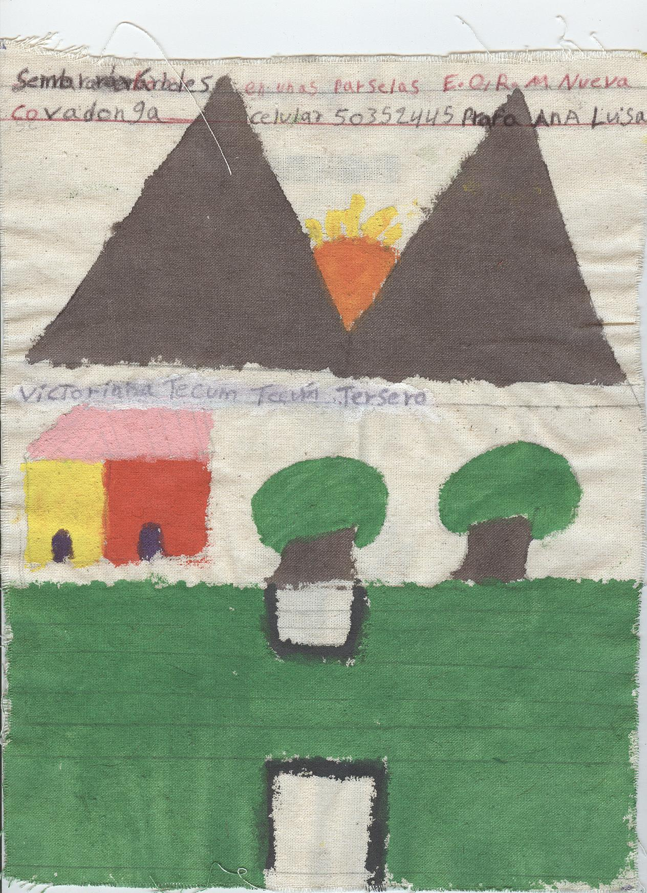

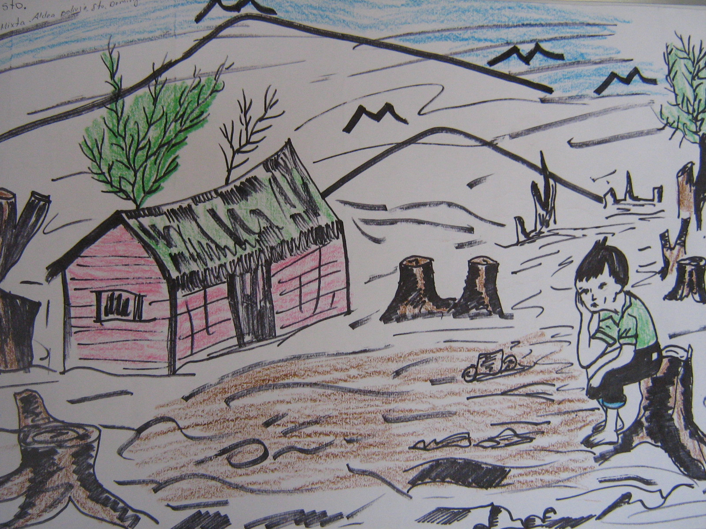

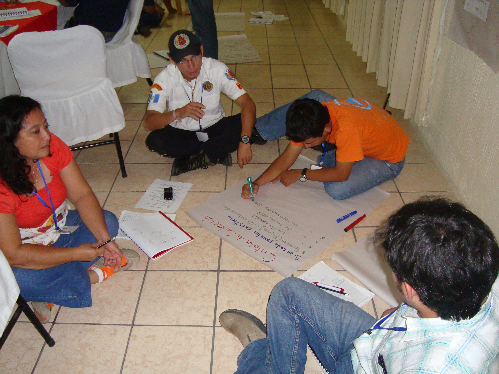

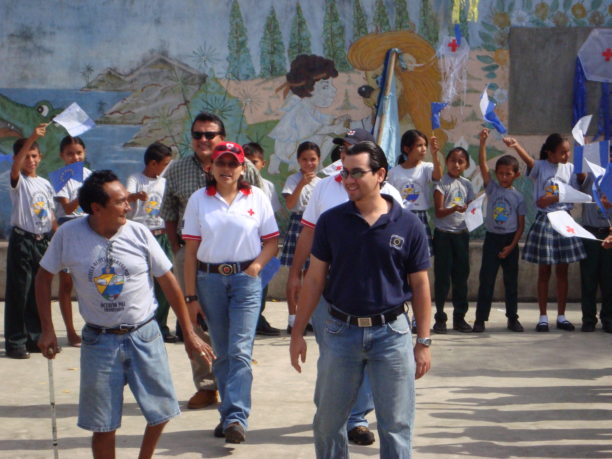

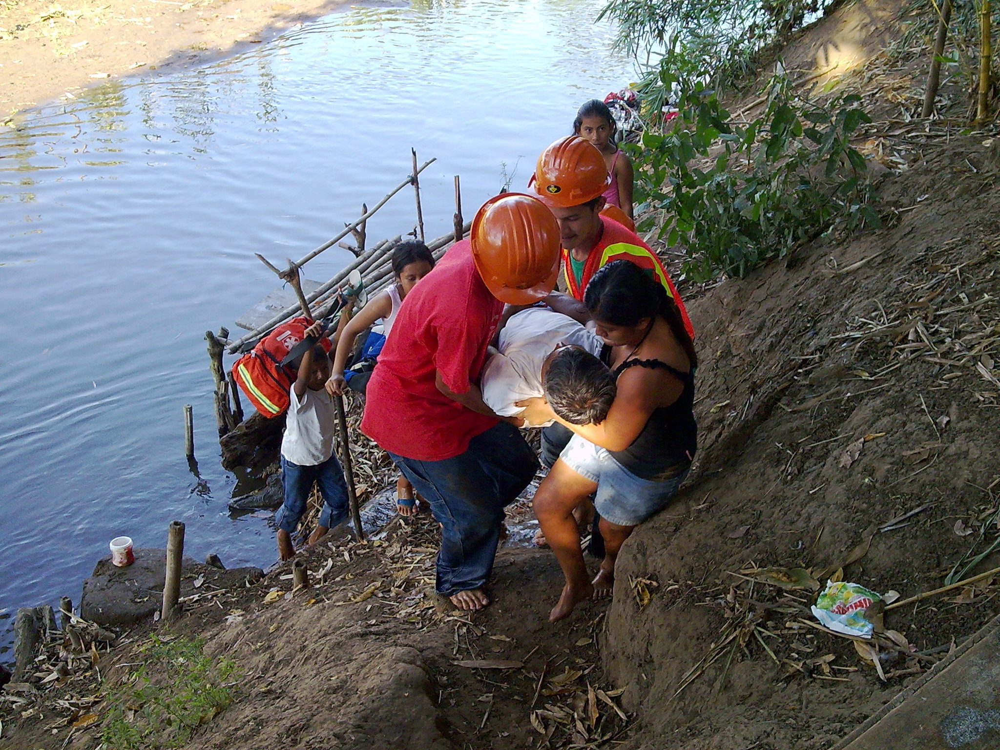

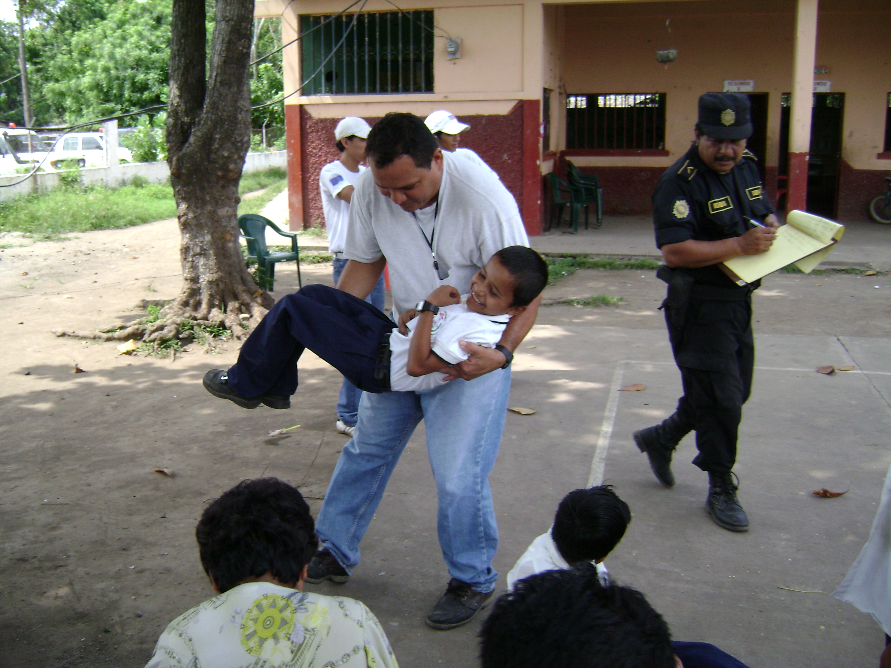

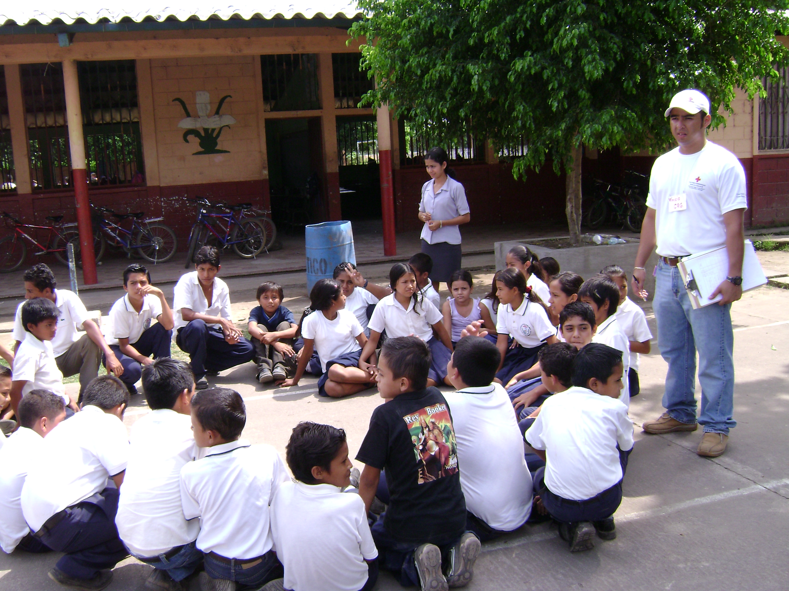

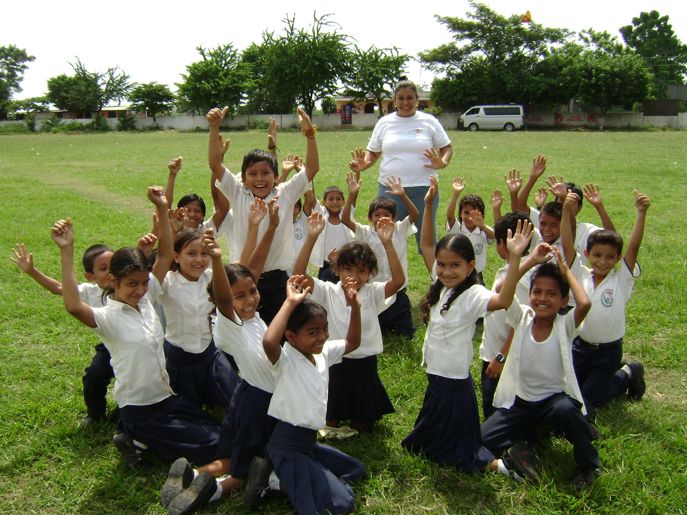

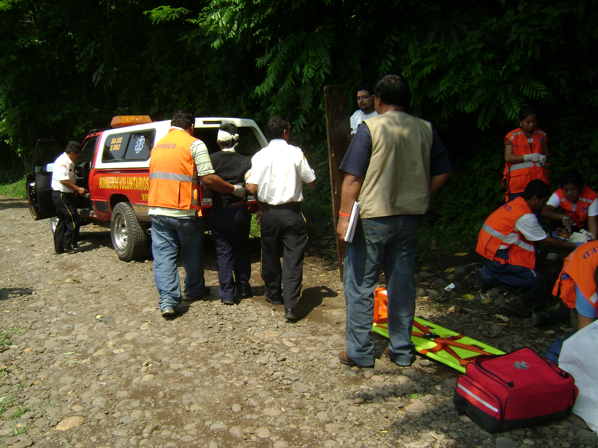

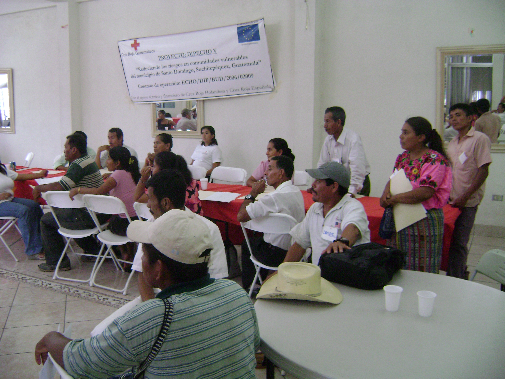

- - - - - - - - - - - - - - - - - - - - - - - - - - - - - - - - - - -

[p01]: proyectos/p01.md	"Programa para el Desarrollo"
[p02]: proyectos/p02.md	"Cooperación Holandesa para Ayuda en Centroamérica -CHACA-"
[p03]: proyectos/p03.md	"Atención a la salud preventiva, agua y saneamiento en 12 comunidades de Alta Verapaz, Guatemala"
[p04]: proyectos/p04.md	"Fortalecimiento de las Capacidades para la mitigación de desastres en el Municipio de Cobán y 30 comunidades de la cuenca del Río Chixoy"
[p05]: proyectos/p05.md	"Reduciendo los Riesgos en Comunidades Vulnerables del  Municipio de Santo Domingo, Departamento de Suchitepéquez, Guatemala"
[p06]: proyectos/p06.md	"Fortaleciendo capacidades ante los riesgos de Cambio Climático en el Oriente de Guatemala"
[p07]: proyectos/p07.md	"Reducción de Vulnerabilidades ante los efectos del Cambio Climático en Guatemala, Fase II"
[p08]: proyectos/p08.md	"Trabajando juntos podemos reducir los riesgos en las comunidades vulnerables de Champerico y Retalhuleu, Guatemala"
[p09]: proyectos/p09.md	"Respuesta inmediata ante las inundaciones provocadas por la Tormenta AGATHA, en la región suroccidente de Guatemala"
[p10]: proyectos/p10.md	"Fortaleciendo la Resiliencia de las comunidades ante los efectos de los desastres en parcelamiento La Máquina, Suchitepéquez y Retalhuleu"
[p11]: proyectos/p11.md	"Reducción del riesgo de desastres incrementados por el Cambio Climático"
[p12]: proyectos/p12.md	"Respuesta Inmediata a los efectos de los sismos en el departamento de Santa Rosa, Guatemala"
[p13]: proyectos/p13.md	"Aumentando la resiliencia ante los desastres en el departamento del Peten, Guatemala"
[p14]: proyectos/p14.md	"Mejorando la Salud Materno Neonatal de Comunidades Vulnerables de San Marcos, Guatemala"

