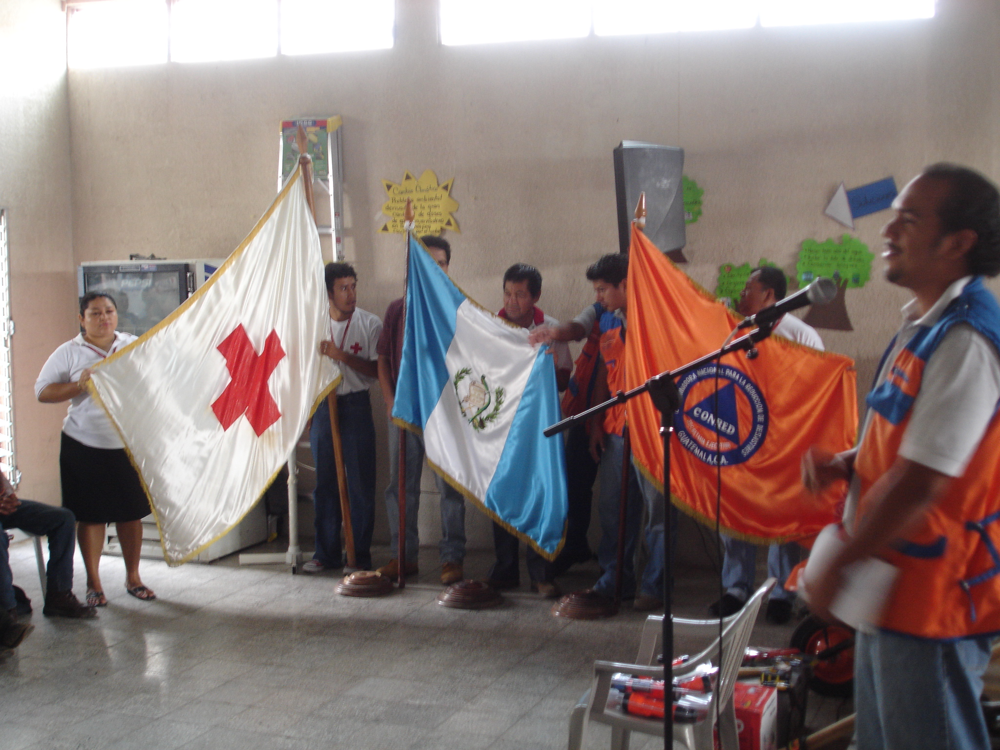
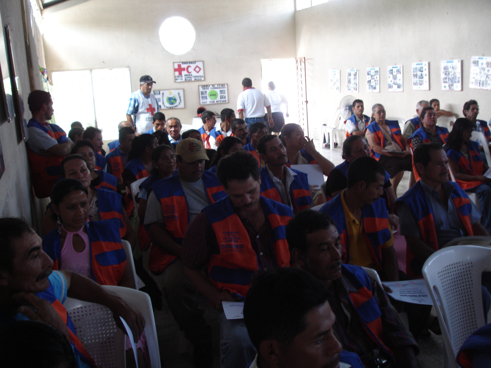
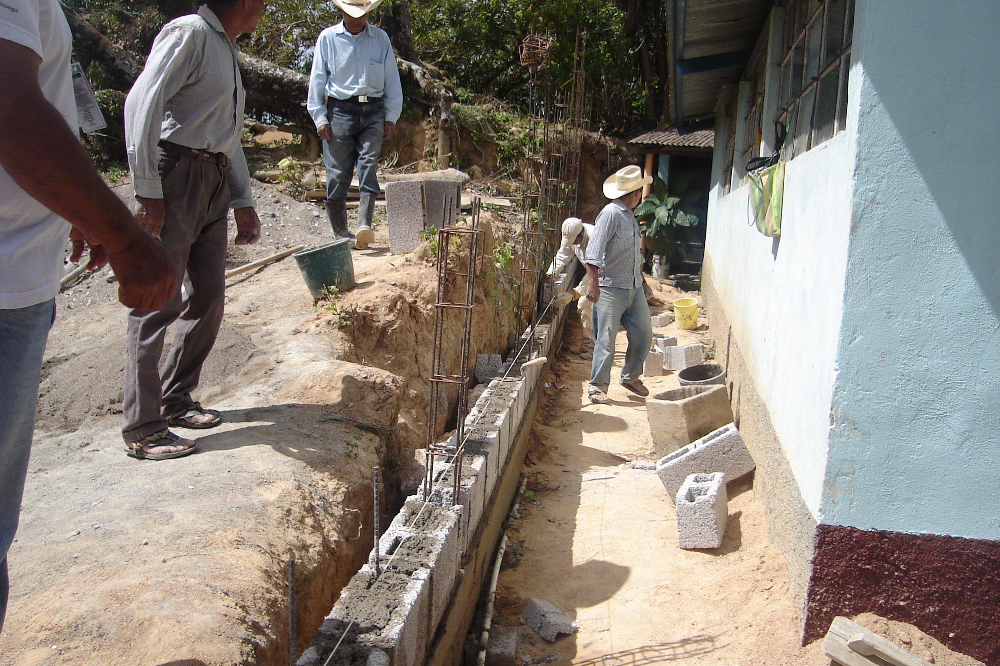
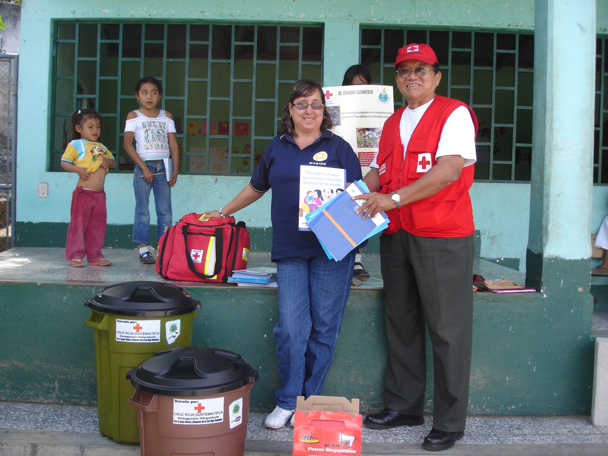
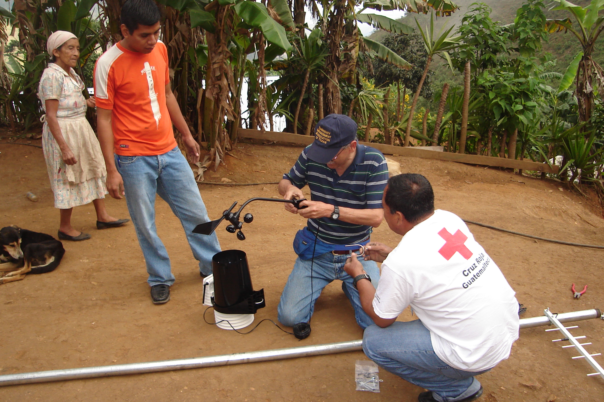
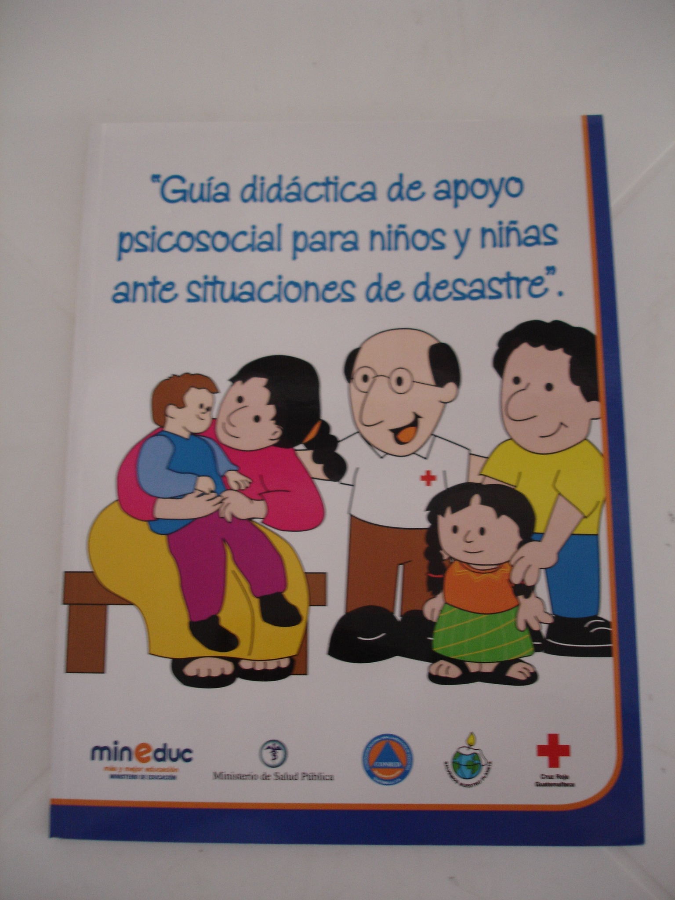
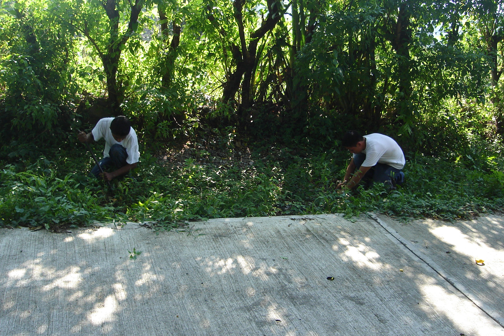
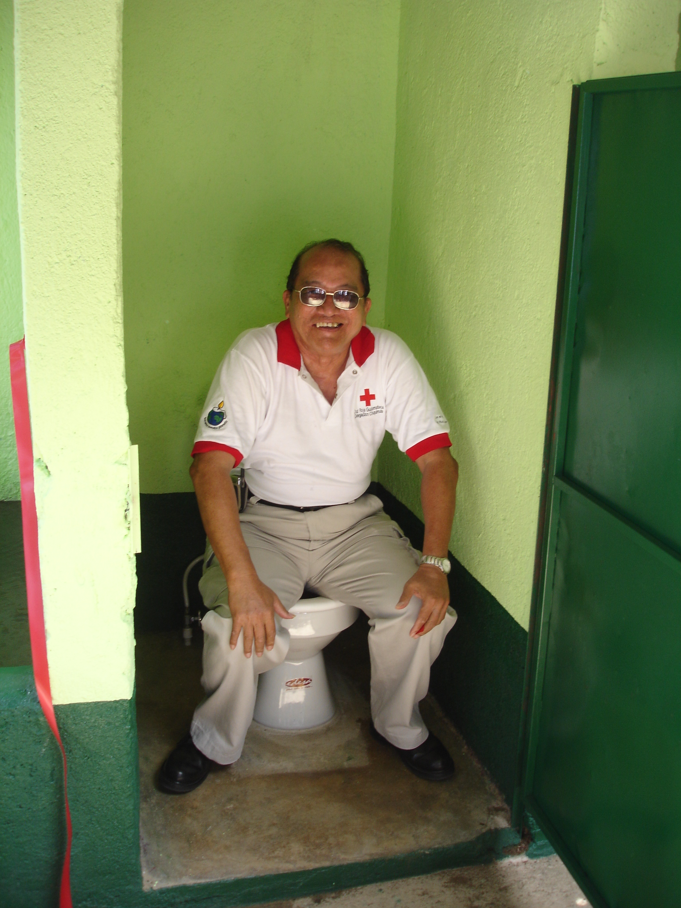

#CC y DP
- - - - - - - - - - - - - - - - - - - - - - - - - - - - - - - - - - -

##Detalles del Proyecto
| Descripción         | Detalle   |
|:--------------------|:---------:|
| Nombre del proyecto | Fortaleciendo capacidades ante los riesgos de Cambio Climático en el Oriente de Guatemala  |
| Donante             | Loteria del Código Postal de Holanda |
| Presupuesto total   | 125.722,29€ |
| Año de ejecución    | 2006 - 2007 |
| Tiempo de ejecución | 20 meses (01/03/2006 al 31/12/2007) |

##Antecedentes
Con base a la experiencia de la Cruz Roja Holandesa con el Centro del Clima y el proyecto piloto de Cambio Climático y Desastres en Nicaragua y Vietnam y con el fin de ampliar y multiplicar los resultados del proyecto, se formuló el proyecto “Fortaleciendo capacidades ante los riesgos de Cambio Climático en el Oriente de Guatemala” cuyo objetivo fue reducir los riesgos del cambio climático en comunidades vulnerables del país. En el año 2006 se inició la implementación del Proyecto cuyo eje principal fue el manejo del tema Cambio Climático a nivel Escolar, Comunitario e Institucional en los países de Guatemala, Costa Rica, Nicaragua y Colombia, con el propósito de reducir los riesgos de éste fenómeno en todos los ámbitos en que se desarrollan las personas. En Guatemala en particular, el proyecto incluyó, entre otros, componentes como preparativos para la respuesta a desastres a nivel escolar y municipal en Chiquimula y promovió la participación comunitaria como actor clave para la intervención en la reducción de riesgos.

##Ubicación
[gimmick:googlemaps(zoom: 12, marker: 'true')](Chiquimula, Chiquimula)
###Departamento
* Chiquimula
####Municipio
* Chiquimula
* San José la Arada

##Objetivos

###Objetivo General
Contribuir a una mejor comprensión y actuación ante los riesgos relacionados con el cambio climático en Guatemala para la reducción de la vulnerabilidad de las comunidades intervenidas..

###Objetivo Específico
1. Impulsar el fortalecimiento de las capacidades para la prevención y respuesta a riesgos y desastres mediante la consolidación del programa de educación comunitaria de preparación para desastres.
 
2. Promover el fortalecimiento de las capacidades institucionales para las intervenciones en caso de desastres por medio del programa de Preparación para Desastres con enfoque a Reducción de Riesgos.

##Beneficiarios
| Descripción                     | Detalle |
|:--------------------------------|:-------:|
| N° beneficiarios directos       | 12,131 |
| N° beneficiarios indirectos     | 30,580 |
| N° de comunidades beneficiarias | 11 |
| Etnia                           | Mestiza |

##Documentos
###Propuestas

<a class="descarga-pdf" href="p06-cc1/1-propuesta/propuesta.pdf">Descargar</a>

###Marco Lógico

<a class="descarga-pdf" href="p06-cc1/1-propuesta/marco_logico_cc.pdf">Descargar</a>

###Informes
####Semestrales
#####Primer Trimestre

<a class="descarga-pdf" href="p06-cc1/2-informes/informe_trimestral-1.pdf">Descargar</a>

#####Segundo Trimestre

<a class="descarga-pdf" href="p06-cc1/2-informes/informe_trimestral-2.pdf">Descargar</a>

#####Tercer Trimestre

<a class="descarga-pdf" href="p06-cc1/2-informes/informe_trimestral-3.pdf">Descargar</a>

#####Cuarto Trimestre

<a class="descarga-pdf" href="p06-cc1/2-informes/informe_trimestral-4.pdf">Descargar</a>

####Final

<a class="descarga-pdf" href="p06-cc1/2-informes/informe_final_cc.pdf">Descargar</a>

###Sistematizaciónes

<a class="descarga-pdf" href="p06-cc1/4-sistematizaciones/presentacion_sistematizacion.pdf">Descargar</a>

##Fotos

###SD

- - -

##Audios
### Spot de Radio - Cambio Climático 1
<audio controls>
  <source src="proyectos/p06-cc1/5-herramientas/spots_radio/cambio_climatico-1.ogg" type="audio/ogg">
  <source src="proyectos/p06-cc1/5-herramientas/spots_radio/cambio_climatico-1.mp3" type="audio/mpeg">
</audio>

### Spot de Radio - Cambio Climático 2
<audio controls>
  <source src="proyectos/p06-cc1/5-herramientas/spots_radio/cambio_climatico-2.ogg" type="audio/ogg">
  <source src="proyectos/p06-cc1/5-herramientas/spots_radio/cambio_climatico-2.mp3" type="audio/mpeg">
</audio>

### Spot de Radio - Cambio Climático 3
<audio controls>
  <source src="proyectos/p06-cc1/5-herramientas/spots_radio/cambio_climatico-3.ogg" type="audio/ogg">
  <source src="proyectos/p06-cc1/5-herramientas/spots_radio/cambio_climatico-3.mp3" type="audio/mpeg">
</audio>

### Spot de Radio - Dengue
<audio controls>
  <source src="proyectos/p06-cc1/5-herramientas/spots_radio/dengue.mp3" type="audio/mpeg">
  <source src="proyectos/p06-cc1/5-herramientas/spots_radio/dengue.ogg" type="audio/ogg">
</audio>

### Spot de Radio - Desastres
<audio controls>
  <source src="proyectos/p06-cc1/5-herramientas/spots_radio/desastres.ogg" type="audio/ogg">
  <source src="proyectos/p06-cc1/5-herramientas/spots_radio/desastres.mp3" type="audio/mpeg">
</audio>

### Spot de Radio - Deslizamientos
<audio controls>
  <source src="proyectos/p06-cc1/5-herramientas/spots_radio/deslizamientos.ogg" type="audio/ogg">
  <source src="proyectos/p06-cc1/5-herramientas/spots_radio/deslizamientos.mp3" type="audio/mpeg">
</audio>

### Spot de Radio - Huracanes
<audio controls>
  <source src="proyectos/p06-cc1/5-herramientas/spots_radio/huracanes.ogg" type="audio/ogg">
  <source src="proyectos/p06-cc1/5-herramientas/spots_radio/huracanes.mp3" type="audio/mpeg">
</audio>

### Spot de Radio - Lluvias
<audio controls>
  <source src="proyectos/p06-cc1/5-herramientas/spots_radio/lluvias.ogg" type="audio/ogg">
  <source src="proyectos/p06-cc1/5-herramientas/spots_radio/lluvias.mp3" type="audio/mpeg">
</audio>

### Spot de Radio - Plan Escolar
<audio controls>
  <source src="proyectos/p06-cc1/5-herramientas/spots_radio/plan_escolar.ogg" type="audio/ogg">
  <source src="proyectos/p06-cc1/5-herramientas/spots_radio/plan_escolar.mp3" type="audio/mpeg">
</audio>

### Spot de Radio - Plan Familiar 1
<audio controls>
  <source src="proyectos/p06-cc1/5-herramientas/spots_radio/plan_familiar-1.ogg" type="audio/ogg">
  <source src="proyectos/p06-cc1/5-herramientas/spots_radio/plan_familiar-1.mp3" type="audio/mpeg">
</audio>

### Spot de Radio - Plan Familiar 2
<audio controls>
  <source src="proyectos/p06-cc1/5-herramientas/spots_radio/plan_familiar-2.ogg" type="audio/ogg">
  <source src="proyectos/p06-cc1/5-herramientas/spots_radio/plan_familiar-2.mp3" type="audio/mpeg">
</audio>

### Spot de Radio - Reforestación
<audio controls>
  <source src="proyectos/p06-cc1/5-herramientas/spots_radio/reforestacion.ogg" type="audio/ogg">
  <source src="proyectos/p06-cc1/5-herramientas/spots_radio/reforestacion.mp3" type="audio/mpeg">
</audio>

### Spot de Radio - Sequías
<audio controls>
  <source src="proyectos/p06-cc1/5-herramientas/spots_radio/sequias.ogg" type="audio/ogg">
  <source src="proyectos/p06-cc1/5-herramientas/spots_radio/sequias.mp3" type="audio/mpeg">
</audio>

### Spot de Radio - Sismos
<audio controls>
  <source src="proyectos/p06-cc1/5-herramientas/spots_radio/sismos.ogg" type="audio/ogg">
  <source src="proyectos/p06-cc1/5-herramientas/spots_radio/sismos.mp3" type="audio/mpeg">
</audio>

### Spot de Radio - Terremotos
<audio controls>
  <source src="proyectos/p06-cc1/5-herramientas/spots_radio/terremotos.ogg" type="audio/ogg">
  <source src="proyectos/p06-cc1/5-herramientas/spots_radio/terremotos.mp3" type="audio/mpeg">
</audio>

- - - - - - - - - - - - - - - - - - - - - - - - - - - - - - - - - - -

[p01]: proyectos/p01.md	"Programa para el Desarrollo"
[p02]: proyectos/p02.md	"Cooperación Holandesa para Ayuda en Centroamérica -CHACA-"
[p03]: proyectos/p03.md	"Atención a la salud preventiva, agua y saneamiento en 12 comunidades de Alta Verapaz, Guatemala"
[p04]: proyectos/p04.md	"Fortalecimiento de las Capacidades para la mitigación de desastres en el Municipio de Cobán y 30 comunidades de la cuenca del Río Chixoy"
[p05]: proyectos/p05.md	"Reduciendo los Riesgos en Comunidades Vulnerables del  Municipio de Santo Domingo, Departamento de Suchitepéquez, Guatemala"
[p06]: proyectos/p06.md	"Fortaleciendo capacidades ante los riesgos de Cambio Climático en el Oriente de Guatemala"
[p07]: proyectos/p07.md	"Reducción de Vulnerabilidades ante los efectos del Cambio Climático en Guatemala, Fase II"
[p08]: proyectos/p08.md	"Trabajando juntos podemos reducir los riesgos en las comunidades vulnerables de Champerico y Retalhuleu, Guatemala"
[p09]: proyectos/p09.md	"Respuesta inmediata ante las inundaciones provocadas por la Tormenta AGATHA, en la región suroccidente de Guatemala"
[p10]: proyectos/p10.md	"Fortaleciendo la Resiliencia de las comunidades ante los efectos de los desastres en parcelamiento La Máquina, Suchitepéquez y Retalhuleu"
[p11]: proyectos/p11.md	"Reducción del riesgo de desastres incrementados por el Cambio Climático"
[p12]: proyectos/p12.md	"Respuesta Inmediata a los efectos de los sismos en el departamento de Santa Rosa, Guatemala"
[p13]: proyectos/p13.md	"Aumentando la resiliencia ante los desastres en el departamento del Peten, Guatemala"
[p14]: proyectos/p14.md	"Mejorando la Salud Materno Neonatal de Comunidades Vulnerables de San Marcos, Guatemala"

