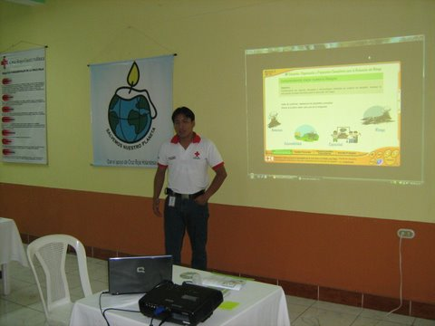
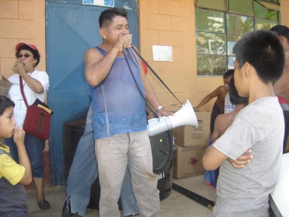
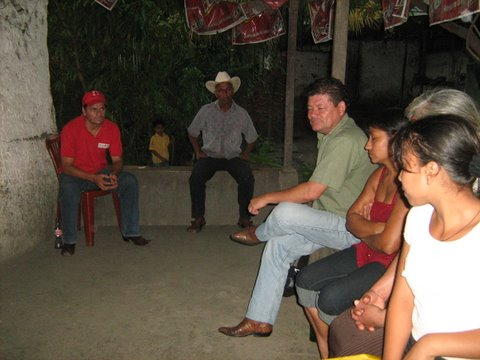
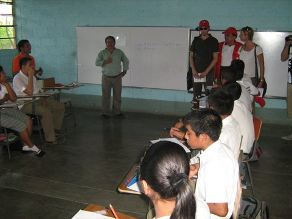
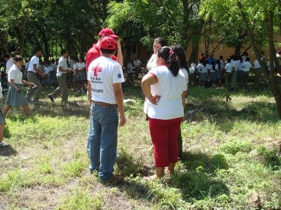
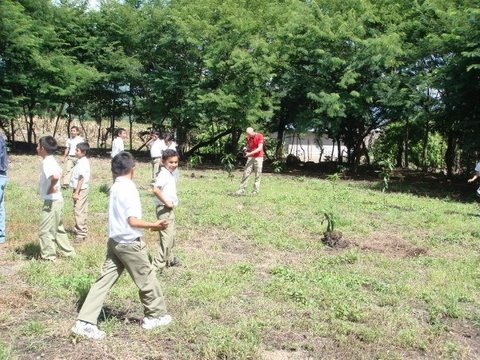

#CC II
- - - - - - - - - - - - - - - - - - - - - - - - - - - - - - - - - - -

##Detalles del Proyecto
| Descripción         | Detalle   |
|:--------------------|:---------:|
| Nombre del proyecto | Reducción de Vulnerabilidades ante los efectos del Cambio Climático en Guatemala, Fase II |
| Donante             | Loteria del Código Postal de Holanda |
| Presupuesto total   | 390,000.00€ |
| Año de ejecución    | 2008 - 2009 |
| Tiempo de ejecución | 20 meses (10/04/2008 al 30/11/2009) |

##Antecedentes
A partir del año 2006 Cruz Roja Guatemalteca, través de la Secretaría Nacional de Desastres, con el apoyo de Cruz Roja Holandesa, y con el objetivo de contribuir a una mejor comprensión y actuación ante los riesgos relacionados con el cambio climático en Guatemala para la reducción de la vulnerabilidad, inicia el proyecto “Fortaleciendo capacidades ante los riesgos de Cambio Climático en el Oriente de Guatemala”, el cual se implementó en 11 comunidades del área rural del departamento de Chiquimula. En el año 2007 finaliza este proyecto dejando muy buenos resultados y experiencias tanto a nivel comunitario como institucional, demandando el seguimiento al tema de Cambio Climático en la región. Es por esta razón inicia el proyecto “Reducción de Vulnerabilidades ante los efectos del Cambio Climático en Guatemala, Fase II”, el cual se implementó en otras 26 comunidades del área rural del departamento de Chiquimula buscando fortalecer la Resiliencia de las personas más vulnerables ante los efectos del Cambio Climático.

##Ubicación
[gimmick:googlemaps(zoom: 11, marker: 'true')](Chiquimula, Chiquimula)
[gimmick:googlemaps(zoom: 11, marker: 'true')](El Estor, Izabal)
###Departamentos
* Chiquimula
* Izabal
####Municipios
* Chiquimula
* El Estor

##Objetivos

###Objetivo General
Fortalecer la resiliencia de las personas más vulnerables ante los riesgos a desastres por los efectos del Cambio Climático en Guatemala a través de un entendimiento mejorado de la dinámica del tema, capacitación y fortalecimiento a la organización comunitaria desde la perspectiva de género, medidas concretas a nivel comunitario y alianzas con otras organizaciones trabajando en el tema.

###Objetivo Específico
1. Fortalecer la capacidad de la Cruz Roja Guatemalteca para que apoye a a su vez a fortalecer la capacidad de 12 comunidades en el municipio de El Estor, del Departamento de Izabal con respecto a Respuesta a emergencias por desastres y adaptabilidad para enfrentar los efectos relacionados al Cambio Climático.

##Beneficiarios
| Descripción                      | Detalle |
|:---------------------------------|:-------:|
| N° beneficiarios(as) directos(as)| 26,539 |
| N° de comunidades beneficiarias  | 26 |
| Etnia                            | Q'qchi' y Mestiza |

##Documentos
###Propuesta

<a class="descarga-pdf" href="p07-cc2/1-propuesta/propuesta_cc_ii.pdf">Descargar</a>

###Informes
####Trimestrales
#####Trimestre octubre/diciembre 2008

<a class="descarga-pdf" href="p07-cc2/2-informes/informe_trimestral_octubre-diciembre_2008.pdf">Descargar</a>

#####Trimestre abril/junio 2009

<a class="descarga-pdf" href="p07-cc2/2-informes/informe_trimestral_abril-junio_2009.pdf">Descargar</a>

#####Trimestre julio/septiembre 2009

<a class="descarga-pdf" href="p07-cc2/2-informes/informe_trimestral_julio-septiembre_2009.pdf">Descargar</a>

####Final

<a class="descarga-pdf" href="p07-cc2/2-informes/informe_final_cap.pdf">Descargar</a>

###Sistematizaciónes
####Sistematización Induccion CAP

<a class="descarga-pdf" href="p07-cc2/4-sistematizaciones/sistematizacion_induccion_cap_2008.pdf">Descargar</a>

####Sistematización Primeros Auxilios

<a class="descarga-pdf" href="p07-cc2/4-sistematizaciones/sistematizacion_primeros_auxilios.pdf">Descargar</a>

####Sistematización Taller AVC

<a class="descarga-pdf" href="p07-cc2/4-sistematizaciones/sistematizacion_taller_avc_07-2008.pdf">Descargar</a>

####Sistematización Taller Emocional

<a class="descarga-pdf" href="p07-cc2/4-sistematizaciones/sistematizacion_taller_emocional.pdf">Descargar</a>

####Sistematización Primeros Auxilios Grupo 1

<a class="descarga-pdf" href="p07-cc2/4-sistematizaciones/sistematizacion_taller_pa_grupo_1.pdf">Descargar</a>

####Sistematización Taller Reforestación

<a class="descarga-pdf" href="p07-cc2/4-sistematizaciones/sistematizacion_taller_reforestacion.pdf">Descargar</a>

####Sistematización Taller Trabajo de Campo

<a class="descarga-pdf" href="p07-cc2/4-sistematizaciones/sistematizacion_trabajo_campo_24-06-08.pdf">Descargar</a>

###Herramientas
####Afiche "El Clima y los niños"

<a class="descarga-pdf" href="p07-cc2/5-herramientas/afiche_el_clima_y_los_ninos.pdf">Descargar</a>

####El CLima

<a class="descarga-pdf" href="p07-cc2/5-herramientas/el_clima.pdf">Descargar</a>

##Fotos
###SD

- - -

##Audios
### Spot de Radio - ¿Sábias qué? 1
<audio controls>
  <source src="proyectos/p07-cc2/5-herramientas/spots_radio/spot_asorech_sabias_que_1.mp3" type="audio/mpeg">
  <source src="proyectos/p07-cc2/5-herramientas/spots_radio/spot_asorech_sabias_que_1.ogg" type="audio/ogg">
</audio>

### Spot de Radio - ¿Sábias qué? 2
<audio controls>
  <source src="proyectos/p07-cc2/5-herramientas/spots_radio/spot_asorech_sabias_que_2.mp3" type="audio/mpeg">
  <source src="proyectos/p07-cc2/5-herramientas/spots_radio/spot_asorech_sabias_que_2.ogg" type="audio/ogg">
</audio>

### Spot de Radio - ¿Sábias qué? 3
<audio controls>
  <source src="proyectos/p07-cc2/5-herramientas/spots_radio/spot_asorech_sabias_que_3.mp3" type="audio/mpeg">
  <source src="proyectos/p07-cc2/5-herramientas/spots_radio/spot_asorech_sabias_que_3.ogg" type="audio/ogg">
</audio>

### Spot de Radio - ¿Sábias qué? 4
<audio controls>
  <source src="proyectos/p07-cc2/5-herramientas/spots_radio/spot_asorech_sabias_que_4.mp3" type="audio/mpeg">
  <source src="proyectos/p07-cc2/5-herramientas/spots_radio/spot_asorech_sabias_que_4.ogg" type="audio/ogg">
</audio>

### Spot de Radio - ¿Sábias qué? 5
<audio controls>
  <source src="proyectos/p07-cc2/5-herramientas/spots_radio/spot_asorech_sabias_que_5.mp3" type="audio/mpeg">
  <source src="proyectos/p07-cc2/5-herramientas/spots_radio/spot_asorech_sabias_que_5.ogg" type="audio/ogg">
</audio>

### Spot de Radio - ¿Sábias qué? 6
<audio controls>
  <source src="proyectos/p07-cc2/5-herramientas/spots_radio/spot_asorech_sabias_que_6.mp3" type="audio/mpeg">
  <source src="proyectos/p07-cc2/5-herramientas/spots_radio/spot_asorech_sabias_que_6.ogg" type="audio/ogg">
</audio>

### Spot de Radio - Español 1
<audio controls>
  <source src="proyectos/p07-cc2/5-herramientas/spots_radio/spot_espanol_1.mp3" type="audio/mpeg">
  <source src="proyectos/p07-cc2/5-herramientas/spots_radio/spot_espanol_1.ogg" type="audio/ogg">
</audio>

### Spot de Radio - Español 2
<audio controls>
  <source src="proyectos/p07-cc2/5-herramientas/spots_radio/spot_espanol_2.mp3" type="audio/mpeg">
  <source src="proyectos/p07-cc2/5-herramientas/spots_radio/spot_espanol_2.ogg" type="audio/ogg">
</audio>

### Spot de Radio - Español 3
<audio controls>
  <source src="proyectos/p07-cc2/5-herramientas/spots_radio/spot_espanol_3.mp3" type="audio/mpeg">
  <source src="proyectos/p07-cc2/5-herramientas/spots_radio/spot_espanol_3.ogg" type="audio/ogg">
</audio>

### Spot de Radio - Español 4
<audio controls>
  <source src="proyectos/p07-cc2/5-herramientas/spots_radio/spot_espanol_4.mp3" type="audio/mpeg">
  <source src="proyectos/p07-cc2/5-herramientas/spots_radio/spot_espanol_4.ogg" type="audio/ogg">
</audio>

### Spot de Radio - Español 5
<audio controls>
  <source src="proyectos/p07-cc2/5-herramientas/spots_radio/spot_espanol_5.mp3" type="audio/mpeg">
  <source src="proyectos/p07-cc2/5-herramientas/spots_radio/spot_espanol_5.ogg" type="audio/ogg">
</audio>

### Spot de Radio - Q'ueqchi' 1
<audio controls>
  <source src="proyectos/p07-cc2/5-herramientas/spots_radio/spot_queqchi_1.mp3" type="audio/mpeg">
  <source src="proyectos/p07-cc2/5-herramientas/spots_radio/spot_queqchi_1.ogg" type="audio/ogg">
</audio>

### Spot de Radio - Q'ueqchi' 2
<audio controls>
  <source src="proyectos/p07-cc2/5-herramientas/spots_radio/spot_queqchi_2.mp3" type="audio/mpeg">
  <source src="proyectos/p07-cc2/5-herramientas/spots_radio/spot_queqchi_2.ogg" type="audio/ogg">
</audio>

### Spot de Radio - Q'ueqchi' 3
<audio controls>
  <source src="proyectos/p07-cc2/5-herramientas/spots_radio/spot_queqchi_3.mp3" type="audio/mpeg">
  <source src="proyectos/p07-cc2/5-herramientas/spots_radio/spot_queqchi_3.ogg" type="audio/ogg">
</audio>

### Spot de Radio - Q'ueqchi' 4
<audio controls>
  <source src="proyectos/p07-cc2/5-herramientas/spots_radio/spot_queqchi_4.mp3" type="audio/mpeg">
  <source src="proyectos/p07-cc2/5-herramientas/spots_radio/spot_queqchi_4.ogg" type="audio/ogg">
</audio>

### Spot de Radio - Q'ueqchi' 5
<audio controls>
  <source src="proyectos/p07-cc2/5-herramientas/spots_radio/spot_queqchi_5.mp3" type="audio/mpeg">
  <source src="proyectos/p07-cc2/5-herramientas/spots_radio/spot_queqchi_5.ogg" type="audio/ogg">
</audio>

- - -

##Videos
#### Spots de Televisión

[Descargar MP4](p07-cc2/5-herramientas/spots_tv/comercial_cambio_climatico-1.mp4 "Spot TV - Cambio Climatico 1") | [Descargar WEBM](p07-cc2/5-herramientas/spots_tv/comercial_cambio_climatico-1.webm "Spot TV - Cambio Climatico 1")

[Descargar MP4](p07-cc2/5-herramientas/spots_tv/comercial_cambio_climatico-2.mp4 "Spot TV - Cambio Climatico 2") | [Descargar WEBM](p07-cc2/5-herramientas/spots_tv/comercial_cambio_climatico-2.webm "Spot TV - Cambio Climatico 2")

[Descargar MP4](p07-cc2/5-herramientas/spots_tv/comercial_cambio_climatico-p1.mp4 "Spot TV - Cambio Climatico P1") | [Descargar WEBM](p07-cc2/5-herramientas/spots_tv/comercial_cambio_climatico-p1.webm "Spot TV - Cambio Climatico P1")

[Descargar MP4](p07-cc2/5-herramientas/spots_tv/comercial_cambio_climatico-p2.mp4 "Spot TV - Cambio Climatico P2") | [Descargar WEBM](p07-cc2/5-herramientas/spots_tv/comercial_cambio_climatico-p2.webm "Spot TV - Cambio Climatico P2")

[Descargar MP4](p07-cc2/5-herramientas/spots_tv/comercial_cambio_climatico-p3.mp4 "Spot TV - Cambio Climatico P3") | [Descargar WEBM](p07-cc2/5-herramientas/spots_tv/comercial_cambio_climatico-p3.webm "Spot TV - Cambio Climatico P3")

- - - - - - - - - - - - - - - - - - - - - - - - - - - - - - - - - - -

[p01]: proyectos/p01.md	"Programa para el Desarrollo"
[p02]: proyectos/p02.md	"Cooperación Holandesa para Ayuda en Centroamérica -CHACA-"
[p03]: proyectos/p03.md	"Atención a la salud preventiva, agua y saneamiento en 12 comunidades de Alta Verapaz, Guatemala"
[p04]: proyectos/p04.md	"Fortalecimiento de las Capacidades para la mitigación de desastres en el Municipio de Cobán y 30 comunidades de la cuenca del Río Chixoy"
[p05]: proyectos/p05.md	"Reduciendo los Riesgos en Comunidades Vulnerables del  Municipio de Santo Domingo, Departamento de Suchitepéquez, Guatemala"
[p06]: proyectos/p06.md	"Fortaleciendo capacidades ante los riesgos de Cambio Climático en el Oriente de Guatemala"
[p07]: proyectos/p07.md	"Reducción de Vulnerabilidades ante los efectos del Cambio Climático en Guatemala, Fase II"
[p08]: proyectos/p08.md	"Trabajando juntos podemos reducir los riesgos en las comunidades vulnerables de Champerico y Retalhuleu, Guatemala"
[p09]: proyectos/p09.md	"Respuesta inmediata ante las inundaciones provocadas por la Tormenta AGATHA, en la región suroccidente de Guatemala"
[p10]: proyectos/p10.md	"Fortaleciendo la Resiliencia de las comunidades ante los efectos de los desastres en parcelamiento La Máquina, Suchitepéquez y Retalhuleu"
[p11]: proyectos/p11.md	"Reducción del riesgo de desastres incrementados por el Cambio Climático"
[p12]: proyectos/p12.md	"Respuesta Inmediata a los efectos de los sismos en el departamento de Santa Rosa, Guatemala"
[p13]: proyectos/p13.md	"Aumentando la resiliencia ante los desastres en el departamento del Peten, Guatemala"
[p14]: proyectos/p14.md	"Mejorando la Salud Materno Neonatal de Comunidades Vulnerables de San Marcos, Guatemala"

