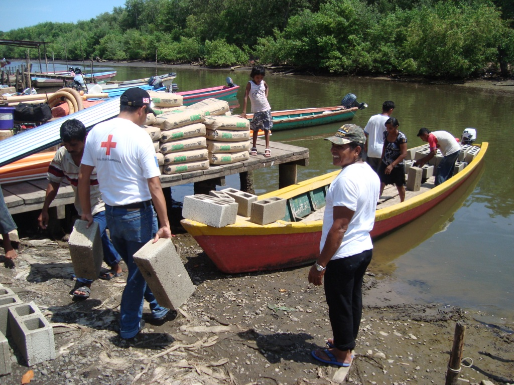
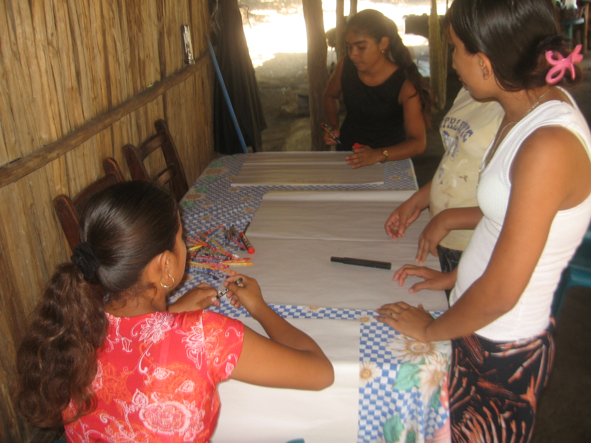

#DIPECHO VI
- - - - - - - - - - - - - - - - - - - - - - - - - - - - - - - - - - -

##Detalles del Proyecto
| Descripción         | Detalle   |
|:--------------------|:---------:|
| Nombre del proyecto | Trabajando juntos podemos reducir los riesgos en las comunidades vulnerables de Champerico y Retalhuleu, Guatemala  |
| Donante             | ECHO |
| Presupuesto total   | 515,000.00€ |
| Año de ejecución    | 2008 - 2010 |
| Tiempo de ejecución | 15 meses (15/09/2008 al 28/02/2010) |

El proyecto se implementó en 21 comunidades de los Municipios de Champerico (14 comunidades) y Retalhuleu (7 comunidades), área priorizada por la Coordinadora Nacional para la Reducción de Desastres (CONRED) en el Taller de Consulta Nacional y en el documento país DIPECHO VI. A través del proyecto se logró que las comunidades rurales y semiurbanas de Champerico y Retalhuleu fortalecieran su capacidad de preparación para responder ante desastres, evidenciándose en la evaluación externa que uno de los factores de éxito fue que la metodología y las herramientas usadas en la preparación para desastres a nivel comunitario ofrecieron una fácil comprensión para los beneficiarios y autoridades locales. Parte de las actividades fueron el levantamiento de AVC comunitarios así como la construcción y validación de planes locales de respuesta, a su vez se dejaron funcionando COLREDES y se trabajó en escuelas, se apoyó con micro-proyectos o pequeñas obras de mitigación y se coordinó con instituciones como INSIVUMEH, PREVDA y CONRED para la adecuada instalación y uso del equipo de SAT ante inundaciones, entre otros logros y acciones del proyecto DIPECHO VI.

##Ubicación
[gimmick:googlemaps(zoom: 9, marker: 'true')](champerico, Retalhuleu)
###Departamento
* Retalhuleu
####Municipios
* Retalhuleu
* Champerico

##Objetivos

###Objetivo General
Contribuir a la reducción de riesgos, a través de una mejor preparación de las poblaciones vulnerables en las áreas más propensas a desastres en Guatemala.

###Objetivo Específico
1. Fortalecer la estructura organizacional, así como también, la capacidad y preparación para responder a los eventos hidrometeorológicos, del sistema de respuesta a nivel municipal y comunitario en Champerico

##Beneficiarios
| Descripción                     | Detalle |
|:--------------------------------|:-------:|
| N° beneficiarios directos       | 14,070 |
| N° beneficiarios indirectos     | 26,554 |
| % hombres                       | 49% |
| % mujeres                       | 51% |
| N° de comunidades beneficiarias | 21 |
| Etnia                           | Mestiza |

##Documentos

###Informes
####Intermedio

<a class="descarga-pdf" href="p08-dipecho6/2-informes/intermediate_report_dipecho_vi.pdf">Descargar</a>

####Final

<a class="descarga-pdf" href="p08-dipecho6/2-informes/final_report_dipecho_vi.pdf">Descargar</a>

###Sistematizaciónes

<a class="descarga-pdf" href="p08-dipecho6/4-sistematizaciones/sistematizacion_dipecho_vi.pdf">Descargar</a>

##Fotos

###SD

- - - - - - - - - - - - - - - - - - - - - - - - - - - - - - - - - - -

[p01]: proyectos/p01.md	"Programa para el Desarrollo"
[p02]: proyectos/p02.md	"Cooperación Holandesa para Ayuda en Centroamérica -CHACA-"
[p03]: proyectos/p03.md	"Atención a la salud preventiva, agua y saneamiento en 12 comunidades de Alta Verapaz, Guatemala"
[p04]: proyectos/p04.md	"Fortalecimiento de las Capacidades para la mitigación de desastres en el Municipio de Cobán y 30 comunidades de la cuenca del Río Chixoy"
[p05]: proyectos/p05.md	"Reduciendo los Riesgos en Comunidades Vulnerables del  Municipio de Santo Domingo, Departamento de Suchitepéquez, Guatemala"
[p06]: proyectos/p06.md	"Fortaleciendo capacidades ante los riesgos de Cambio Climático en el Oriente de Guatemala"
[p07]: proyectos/p07.md	"Reducción de Vulnerabilidades ante los efectos del Cambio Climático en Guatemala, Fase II"
[p08]: proyectos/p08.md	"Trabajando juntos podemos reducir los riesgos en las comunidades vulnerables de Champerico y Retalhuleu, Guatemala"
[p09]: proyectos/p09.md	"Respuesta inmediata ante las inundaciones provocadas por la Tormenta AGATHA, en la región suroccidente de Guatemala"
[p10]: proyectos/p10.md	"Fortaleciendo la Resiliencia de las comunidades ante los efectos de los desastres en parcelamiento La Máquina, Suchitepéquez y Retalhuleu"
[p11]: proyectos/p11.md	"Reducción del riesgo de desastres incrementados por el Cambio Climático"
[p12]: proyectos/p12.md	"Respuesta Inmediata a los efectos de los sismos en el departamento de Santa Rosa, Guatemala"
[p13]: proyectos/p13.md	"Aumentando la resiliencia ante los desastres en el departamento del Peten, Guatemala"
[p14]: proyectos/p14.md	"Mejorando la Salud Materno Neonatal de Comunidades Vulnerables de San Marcos, Guatemala"

