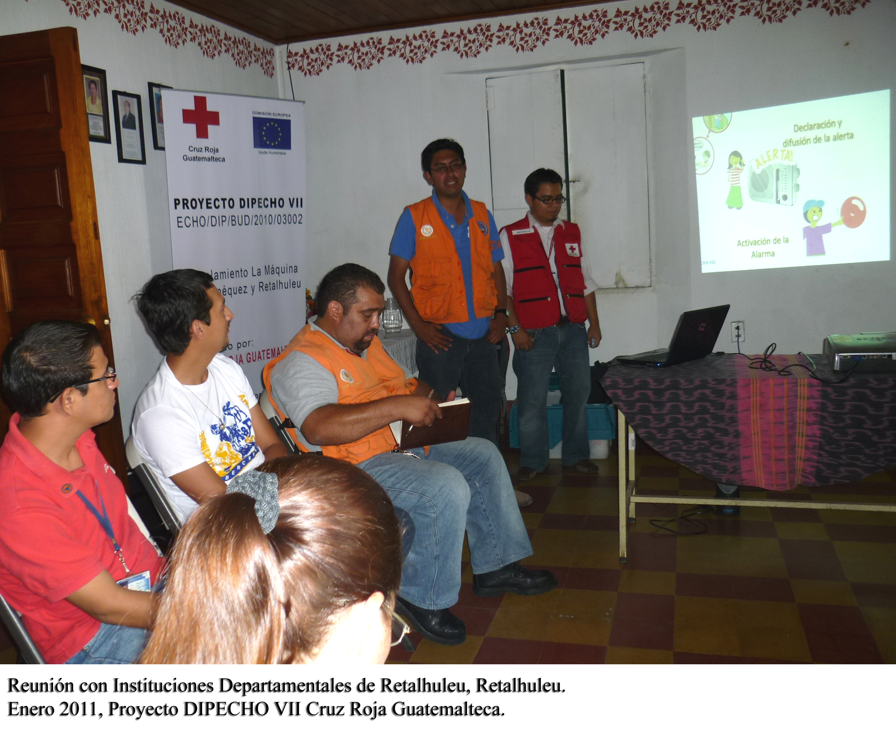

#Emergencia Agatha
- - - - - - - - - - - - - - - - - - - - - - - - - - - - - - - - - - -

##Detalles del Proyecto
| Descripción         | Detalle   |
|:--------------------|:---------:|
| Nombre del proyecto | Respuesta inmediata ante las inundaciones provocadas por la Tormenta AGATHA, en la región suroccidente de Guatemala |
| Donante             | ECHO |
| Presupuesto total   | 380,000.00€ |
| Año de ejecución    | 2010 |
| Tiempo de ejecución | 3 meses (29/05/2010 al 30/08/2010) |

##Antecedentes
El 28 de mayo se formó una perturbación tropical que en el transcurso de las horas se convertiría en la depresión tropical Agatha. Para la madrugada del 29 de mayo la depresión tropical aumentó su fuerza y se convirtió en la primera tormenta tropical del 2010 en el Pacífico. Miles de familias se despertaron el 30 de mayo en refugios o casas de familiares tras ser evacuados, debido a las inundaciones en muchas comunidades en todo el país. Dos días antes de la llegada de la depresión tropical Agatha, el volcán Pacaya comenzó un período de actividad volcánica seguido de una explosión repentina que expulsó cenizas y rocas volcánicas en los departamentos cerca de Escuintla, incluyendo el Departamento de Guatemala. Esto llevó al cierre del aeropuerto internacional "La Aurora", el daño a los sistemas de alcantarillado y colapso de muchos drenajes. El proyecto de ayuda humanitaria de la Cruz Roja Guatemalteca con apoyo financiero y técnico de Cruz Roja Holandesa benefició a 2. 530 familias (1,175 familias del Departamento de Suchitepéquez y 1,175 familias del Departamento de Retalhuleu), distribuyendo alimentos a los damnificados en coordinación con PMA, junto a la distribución de 1 kit de higiene, 5 mantas, 1 filtro de agua y 1 mosquito net por familia. 

##Ubicación

###Departamentos
* Suchitepequez
* Retalhuleu
####Municipios
* 8 municipios

##Objetivos

###Objetivo General
Mitigar los efectos de la Tormenta Agatha en las comunidades afectadas, ofreciendo a las familias artículos de ayuda humanitaria que les permitan recuperar en el corto plazo sus condiciones de vida.

###Objetivo Específico
1. Proveer a las familias  afectadas por las inundaciones ayuda humanitaria

##Beneficiarios
| Descripción                     | Detalle |
|:--------------------------------|:-------:|
| N° beneficiarios directos       | 2,350 familias / 12,697 personas aproximadamente |
| % hombres                       | 49% |
| % mujeres                       | 51% |
| N° de comunidades beneficiarias | 52 |

##Documentos
###Informes Final

<a class="descarga-pdf" href="p09-agatha/2-informes/final_narrative_report.pdf">Descargar</a>

##Fotos
###SD

- - - - - - - - - - - - - - - - - - - - - - - - - - - - - - - - - - -

[p01]: proyectos/p01.md	"Programa para el Desarrollo"
[p02]: proyectos/p02.md	"Cooperación Holandesa para Ayuda en Centroamérica -CHACA-"
[p03]: proyectos/p03.md	"Atención a la salud preventiva, agua y saneamiento en 12 comunidades de Alta Verapaz, Guatemala"
[p04]: proyectos/p04.md	"Fortalecimiento de las Capacidades para la mitigación de desastres en el Municipio de Cobán y 30 comunidades de la cuenca del Río Chixoy"
[p05]: proyectos/p05.md	"Reduciendo los Riesgos en Comunidades Vulnerables del  Municipio de Santo Domingo, Departamento de Suchitepéquez, Guatemala"
[p06]: proyectos/p06.md	"Fortaleciendo capacidades ante los riesgos de Cambio Climático en el Oriente de Guatemala"
[p07]: proyectos/p07.md	"Reducción de Vulnerabilidades ante los efectos del Cambio Climático en Guatemala, Fase II"
[p08]: proyectos/p08.md	"Trabajando juntos podemos reducir los riesgos en las comunidades vulnerables de Champerico y Retalhuleu, Guatemala"
[p09]: proyectos/p09.md	"Respuesta inmediata ante las inundaciones provocadas por la Tormenta AGATHA, en la región suroccidente de Guatemala"
[p10]: proyectos/p10.md	"Fortaleciendo la Resiliencia de las comunidades ante los efectos de los desastres en parcelamiento La Máquina, Suchitepéquez y Retalhuleu"
[p11]: proyectos/p11.md	"Reducción del riesgo de desastres incrementados por el Cambio Climático"
[p12]: proyectos/p12.md	"Respuesta Inmediata a los efectos de los sismos en el departamento de Santa Rosa, Guatemala"
[p13]: proyectos/p13.md	"Aumentando la resiliencia ante los desastres en el departamento del Peten, Guatemala"
[p14]: proyectos/p14.md	"Mejorando la Salud Materno Neonatal de Comunidades Vulnerables de San Marcos, Guatemala"

