#DIPECHO VII
- - - - - - - - - - - - - - - - - - - - - - - - - - - - - - - - - - -

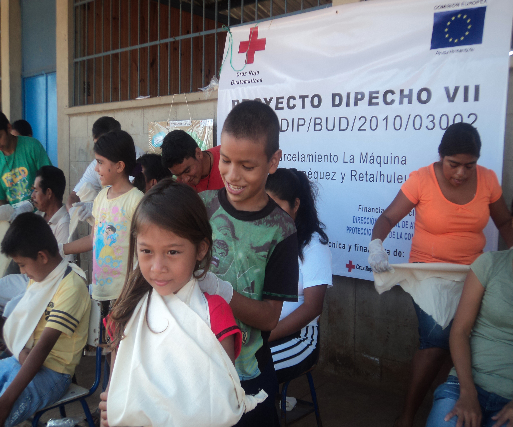

##Detalles del Proyecto
| Descripción         | Detalle   |
|:--------------------|:---------:|
| Nombre del proyecto | Fortaleciendo la Resiliencia de las comunidades ante los efectos de los desastres en parcelamiento La Máquina, Suchitepéquez y Retalhuleu |
| Donante             | ECHO |
| Presupuesto total   | 543,254.00€ |
| Año de ejecución    | 2010 - 2011 |
| Tiempo de ejecución | 15 meses (01/09/2010 al 31/12/2011) |

##Antecedentes
El proyecto DIPECHO VII “Fortaleciendo la Resiliencia de las comunidades ante los efectos de los desastres en Cuyotenango, La Máquina y  Suchitepéquez en Retalhuleu” se implementó en 15 comunidades de dos jurisdicciones departamentales distintas pero con colindancia geográfica y riesgos compartidos. Esta alianza territorial e institucional permitió unir a toda la región bajo un único sistema de alerta temprana (SAT) y unificar herramientas y métodos de trabajo en las comunidades. Se logró elaborar el plan de respuesta territorial de Suchitepéquez y Retalhuleu el cual integró los planes familiares, municipales, departamentales, institucionales y escolares permitiendo de esta forma disponer de una visión integral de la amenaza compartida. Al igual que en anteriores acciones DIPECHO el proyecto ejecutó 1 micro-proyecto por comunidad donde en más de la mitad de los casos se rehabilitó un área de la escuela de la comunidad como Albergue Temporal de Emergencia.

##Ubicación
[gimmick:googlemaps(zoom: 11, marker: 'true')](San Andrés Villa Seca, Retalhuleu)
###Departamentos
* Suchitepequez
* Retalhuleu
####Municipios
* Cuyotenango
* San Andrés Villa Seca

##Objetivos

###Objetivo General
Fortalecer las capacidades de respuesta, preparación y mitigación ante desastres de la población más vulnerable, residente en comunidades de la región de Suchitepéquez y Retalhuleu.
###Objetivo Específico
1. Contribuir al fortalecimiento del sistema local de gestión de desastres en la región suroccidente de Guatemala.

##Beneficiarios
| Descripción                     | Detalle |
|:--------------------------------|:-------:|
| N° beneficiarios directos       | 13,875 |
| N° beneficiarios indirectos en Suchitepéquez | 504,267 |
| N° beneficiarios indirectos Retalhuleu | 297,385 |
| N° beneficiarios indirectos Totales | 801,652 |
| % hombres                       | 49% |
| % mujeres                       | 51% |
| N° de comunidades beneficiarias | 15	|
| Etnia                           | Mestiza |

##Documentos
###Informes
####Intermedio

<a class="descarga-pdf" href="p10-dipecho7/2-informes/informe_intermedio_dipecho_vii.pdf">Descargar</a>

####Final

<a class="descarga-pdf" href="p10-dipecho7/2-informes/final_report_dipecho_vii.pdf">Descargar</a>

##Fotos

###SD
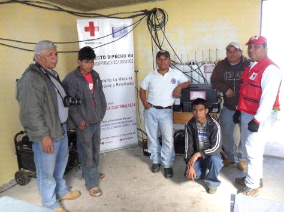
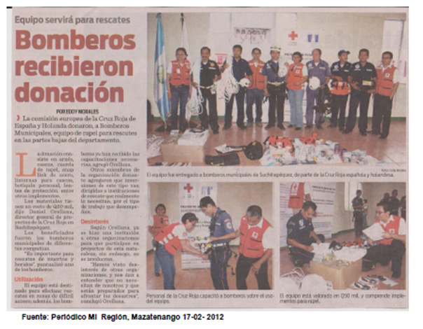
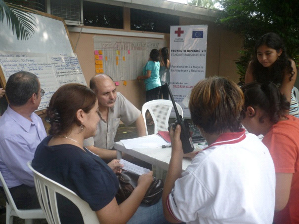
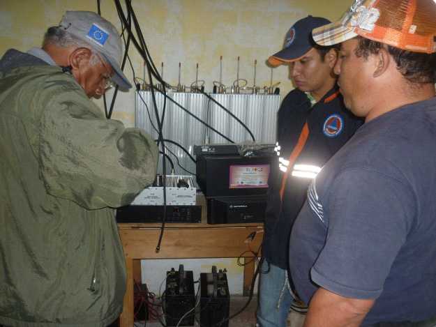

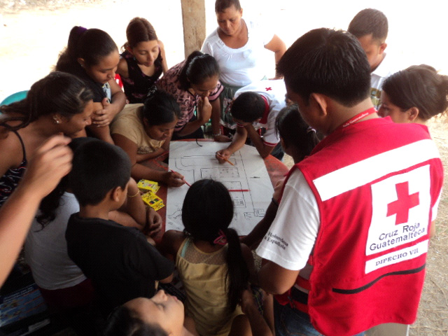
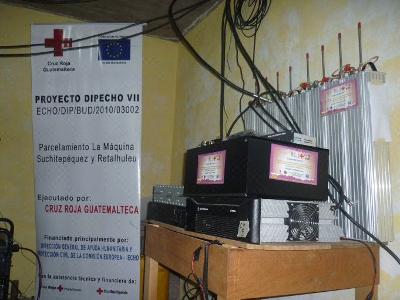
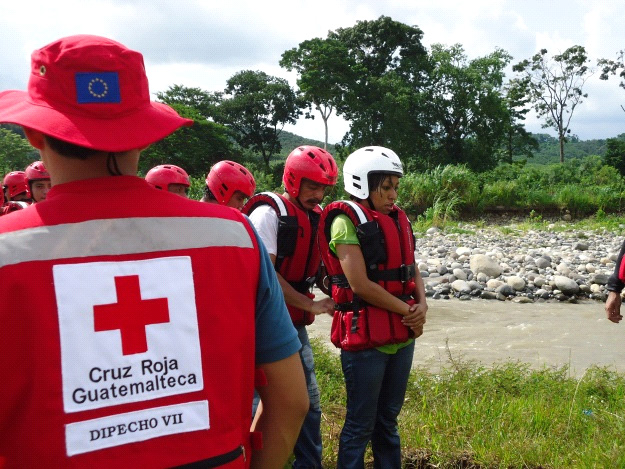
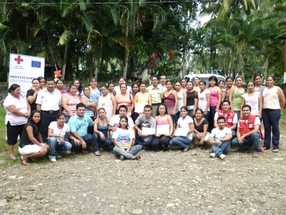

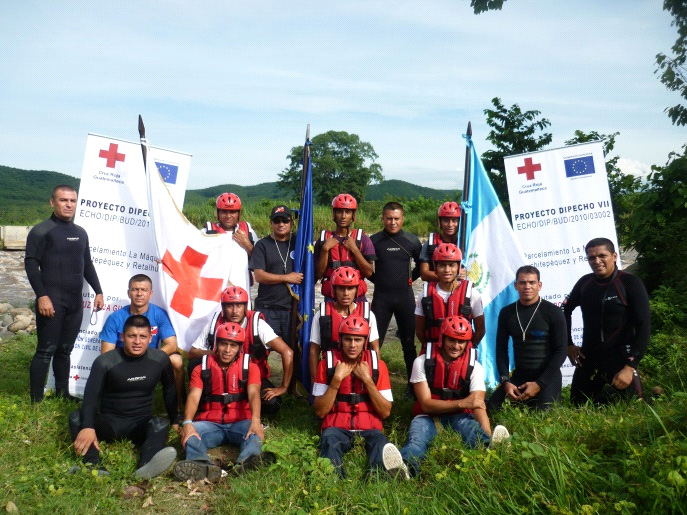
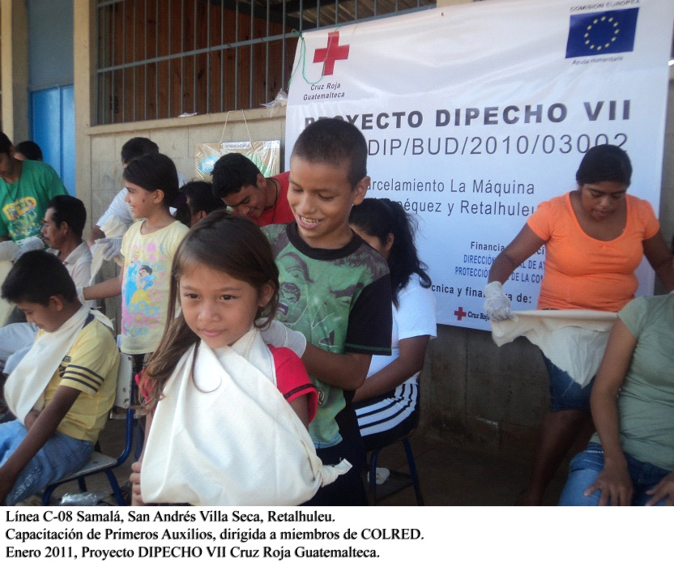
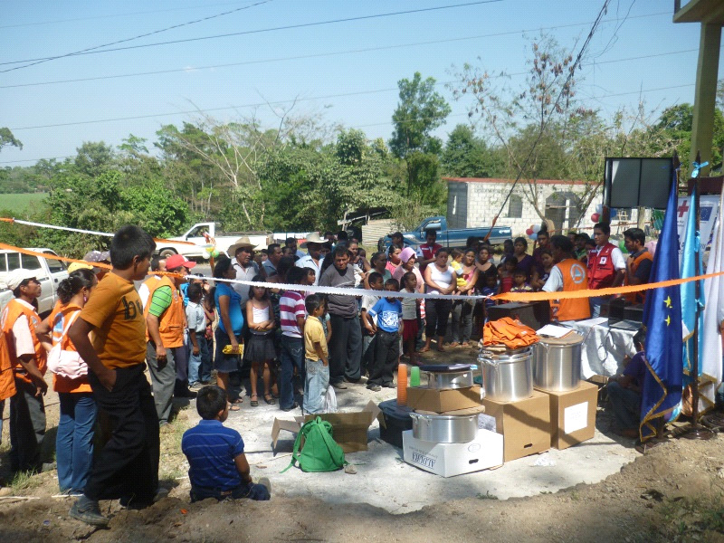
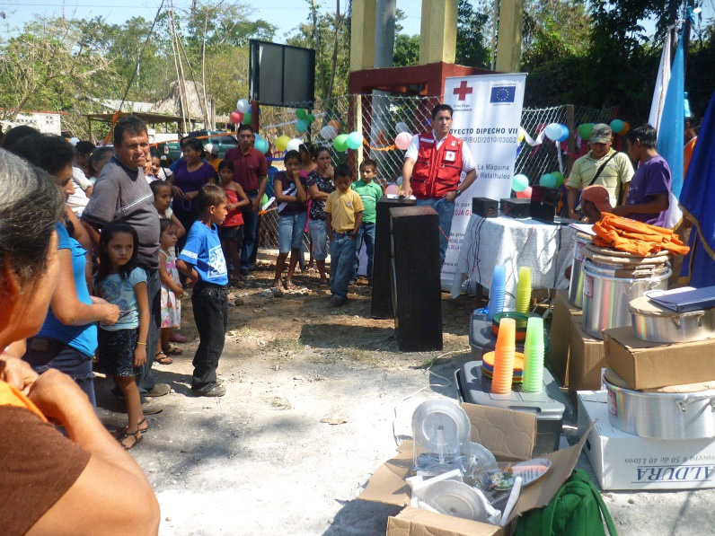

- - - - - - - - - - - - - - - - - - - - - - - - - - - - - - - - - - -

[p01]: proyectos/p01.md	"Programa para el Desarrollo"
[p02]: proyectos/p02.md	"Cooperación Holandesa para Ayuda en Centroamérica -CHACA-"
[p03]: proyectos/p03.md	"Atención a la salud preventiva, agua y saneamiento en 12 comunidades de Alta Verapaz, Guatemala"
[p04]: proyectos/p04.md	"Fortalecimiento de las Capacidades para la mitigación de desastres en el Municipio de Cobán y 30 comunidades de la cuenca del Río Chixoy"
[p05]: proyectos/p05.md	"Reduciendo los Riesgos en Comunidades Vulnerables del  Municipio de Santo Domingo, Departamento de Suchitepéquez, Guatemala"
[p06]: proyectos/p06.md	"Fortaleciendo capacidades ante los riesgos de Cambio Climático en el Oriente de Guatemala"
[p07]: proyectos/p07.md	"Reducción de Vulnerabilidades ante los efectos del Cambio Climático en Guatemala, Fase II"
[p08]: proyectos/p08.md	"Trabajando juntos podemos reducir los riesgos en las comunidades vulnerables de Champerico y Retalhuleu, Guatemala"
[p09]: proyectos/p09.md	"Respuesta inmediata ante las inundaciones provocadas por la Tormenta AGATHA, en la región suroccidente de Guatemala"
[p10]: proyectos/p10.md	"Fortaleciendo la Resiliencia de las comunidades ante los efectos de los desastres en parcelamiento La Máquina, Suchitepéquez y Retalhuleu"
[p11]: proyectos/p11.md	"Reducción del riesgo de desastres incrementados por el Cambio Climático"
[p12]: proyectos/p12.md	"Respuesta Inmediata a los efectos de los sismos en el departamento de Santa Rosa, Guatemala"
[p13]: proyectos/p13.md	"Aumentando la resiliencia ante los desastres en el departamento del Peten, Guatemala"
[p14]: proyectos/p14.md	"Mejorando la Salud Materno Neonatal de Comunidades Vulnerables de San Marcos, Guatemala"

