#MFS II
- - - - - - - - - - - - - - - - - - - - - - - - - - - - - - - - - - -

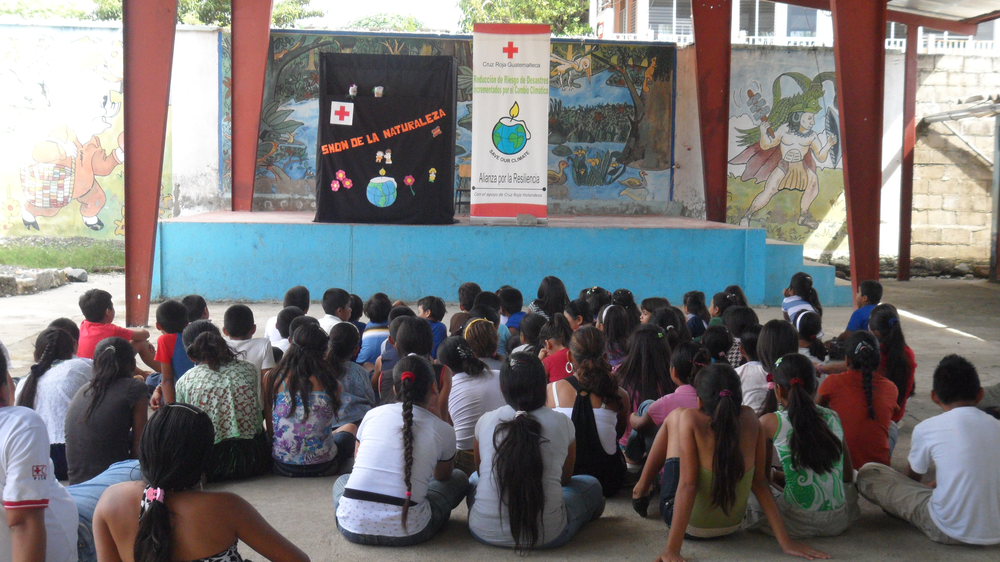

##Detalles del Proyecto
| Descripción         | Detalle   |
|:--------------------|:---------:|
| Nombre del proyecto | Reducción del riesgo de desastres incrementados por el Cambio Climático |
| Donante             | Gobierno de los Países Bajos |
| Presupuesto total   | 1,229,492.00 € + 50,000 € (para el año 2015) |
| Año de ejecución    | 2011 - 2015 |
| Tiempo de ejecución | 5 años (01/01/2011 al 31/12/2015) |

##Antecedentes
Cinco organizaciones humanitarias basadas en Los Países Bajos - Cruz Roja Holandesa, CARE Nederland, Cordaid, Wetlands International y el Centro del Clima de la Cruz Roja/Media Luna Roja – cooperan desde el año 2011 en 9 países por un período de 5 años por una “Alianza por la Resiliencia”. El trabajo de estas organizaciones junto a sus contrapartes locales tienen como objetivo aumentar la resiliencia de las comunidades para enfrentar los efectos de los desastres magnificados por el cambio climático. En Guatemala en particular, la Cruz Roja Guatemalteca ha venido ejecutando el proyecto en los departamentos de Quiché (Joyabaj, Sacapulas, Santa Cruz del Quiché y San Bartolomé Jocotenango) e Izabal (El Estor) bajo un enfoque integrado de los sectores que componen el proyecto: 1) Reducción de riesgos de desastres (RRD), 2) Adaptación de cambio climático (ACC) y 3) Manejo y restauración de ecosistemas (MRE). El tema central es entender mejor la interrelación entre estos 3 sectores para obtener ganancias a través de sinergias, con un modelo de colaboración basado en el intercambio de conocimiento, al soporte técnico, a la construcción cooperativa de capacidades, y a la incidencia y al dialogo político. El programa estará finalizando en Diciembre del 2015.
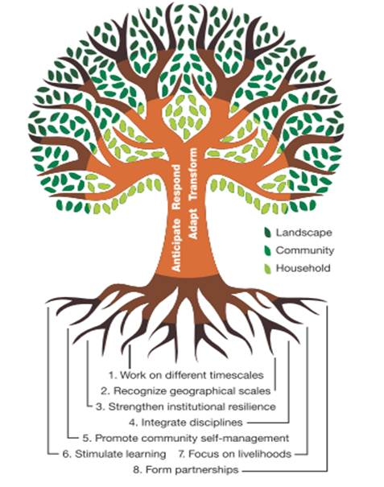

##Ubicación
[gimmick:googlemaps(zoom: 11, marker: 'true')](Santa Cruz del Quiché, Guatemala)
[gimmick:googlemaps(zoom: 11, marker: 'true')](El Estor, Izabal)
###Departamentos
* Quiché
* Izabal

####Municipios
* Quiché
* El Estor 

##Objetivos

###Objetivo General
Reducida la vulnerabilidad y mejorada la capacidad de resiliencia de las poblaciones metas para enfrentar los efectos de los desastres magnificados por el cambio climático..

###Objetivos Específicos
Hay tres alcances incluyendo una estrategia para cada una:

1. Las comunidades son más resistentes a las amenazas inducidas por el cambio climático
  * Estrategia: Fortalecimiento de resiliencia comunitaria. Esta estrategia está relacionado al conocimiento de las comunidades implicando que las comunidades saben cómo equilibrar producción y protección de su ambiente natural y saben cuáles amenazas enfrenten (en una manera incrementando).
2. Las ONGs /OBCs aplican RRD, ACC, MRE en asistencia y incidencia política
  * Estrategia: Fortalecimiento Organizaciones de la Sociedad Civil. Por esta estrategia ONGs/OBCs tienen una red y plataforma para RRD/ACC/MRE y tienen conocimiento acerca de RRD/ACC/MRE
3. Lograr que el ambiente institucional, del nivel internacional a local, sea más favorable a la integración de las metodologías RRD/ACC/MRE
  * Estrategia: Diálogo político y cabildeo por leyes en relación con RRD/ACC/MRE para mejorar la gobernabilidad e incrementar los recursos a todos los niveles.  La estrategia facilita que gobiernos tienen conocimiento de RRD/ACC/MRE, que leyes y políticas favorables a RRD/ACC/MRE son preparadas, y que hay un incremento de los fondos del gobierno para RRD/ACC/MRE.

##Beneficiarios
| Descripción                     | Detalle |
|:--------------------------------|:-------:|
| N° de comunidades beneficiarias | 8 |
| N° beneficiarios indirectos en Quiché | 8,651 (Comunidades 8,527, instituciones= 30, universidades =  50, Docentes =  44)|
| N° beneficiarios indirectos El Estor | 22,189 (Docentes = 107, alumnos = 2,853, Instituciones = 25, universidades = 30) |
| N° beneficiarios indirectos Totales | 30,840 |
| Etnia                           | Q'eqchi' y Qiche' |

##Documentos
###Informes

####Intermedios
#####Español

<a class="descarga-pdf" href="p11-mfs/2-informes/informe_intermedio-2013_esp.pdf">Descargar</a>

#####Ingles

<a class="descarga-pdf" href="p11-mfs/2-informes/informe_intermedio_2013_eng.pdf">Descargar</a>

####Anuales
#####2012

<a class="descarga-pdf" href="p11-mfs/2-informes/informe_anual_2012.pdf">Descargar</a>

#####2013

<a class="descarga-pdf" href="p11-mfs/2-informes/informe_anual_2013.pdf">Descargar</a>

#####2014

<a class="descarga-pdf" href="p11-mfs/2-informes/informe_anual_2014.pdf">Descargar</a>

<a class="descarga-pdf" href="p11-mfs/2-informes/informe_anual_2014-nota.pdf">Descargar</a>

####Final

<a class="descarga-pdf" href="p11-mfs/2-informes/presentacion_oficial_pfr.pdf">Descargar</a>

####Indicadores

<a class="descarga-pdf" href="p11-mfs/2-informes/indicadores_mye_2014.pdf">Descargar</a>

##Fotos
###SD
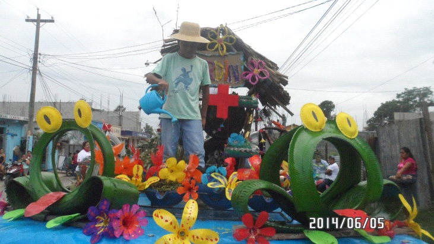
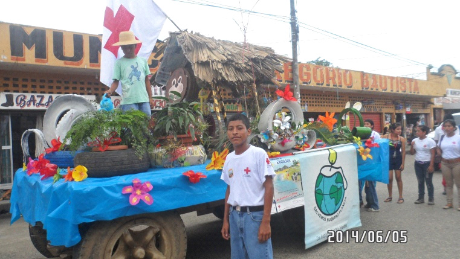
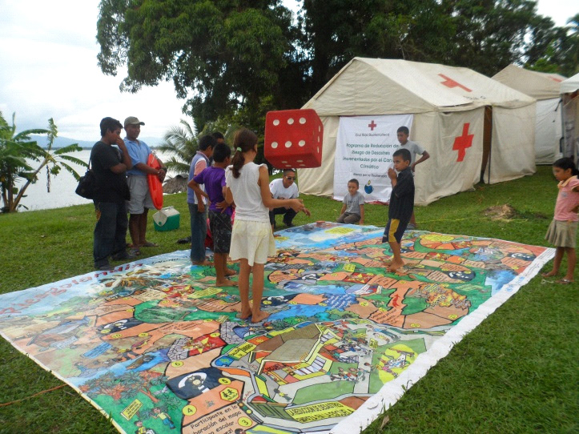

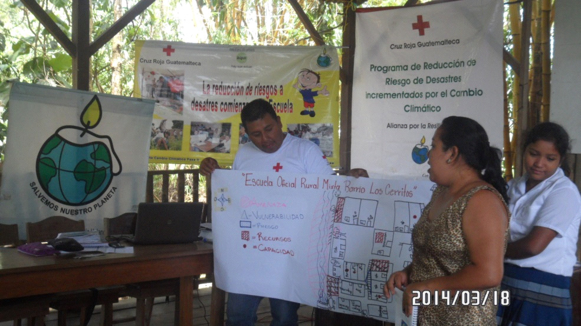
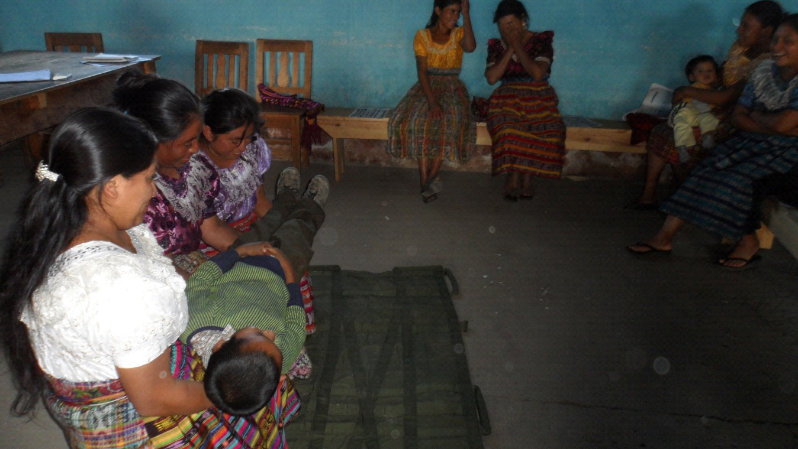
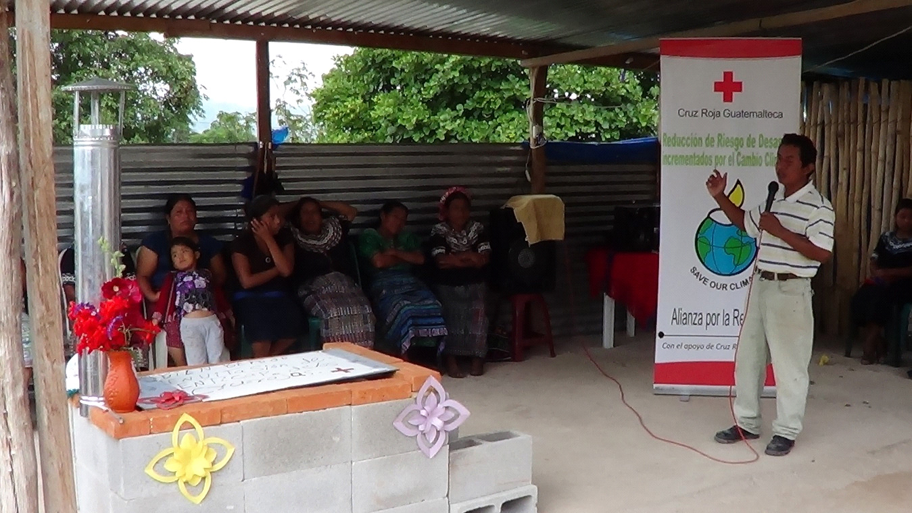

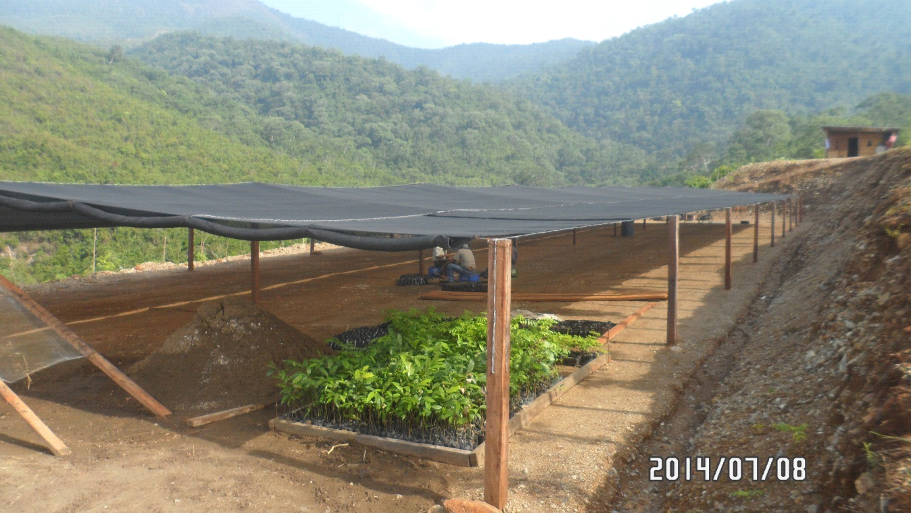
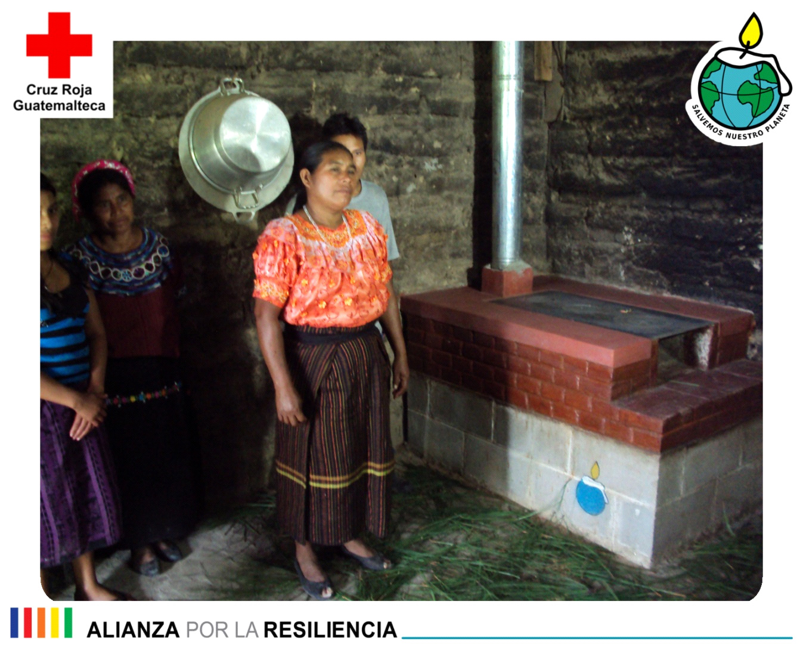
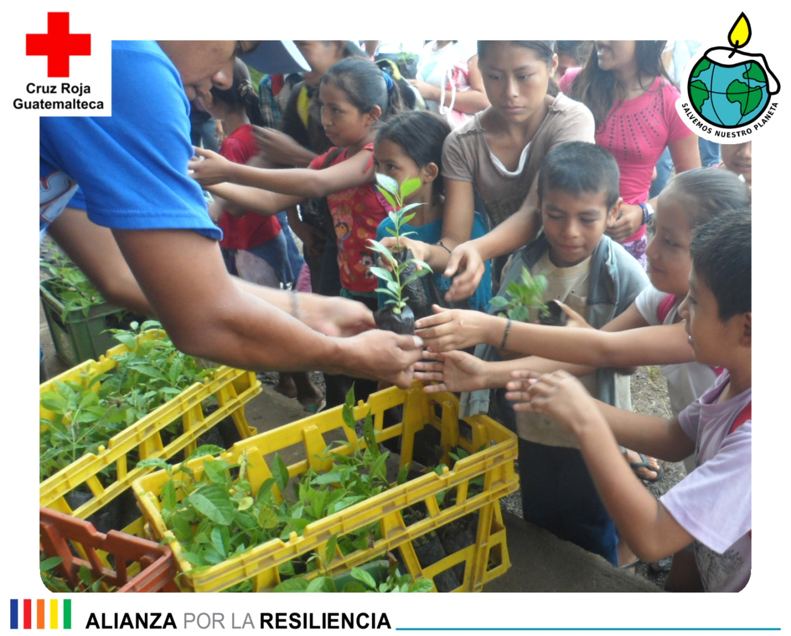

- - - - - - - - - - - - - - - - - - - - - - - - - - - - - - - - - - -

[p01]: proyectos/p01.md	"Programa para el Desarrollo"
[p02]: proyectos/p02.md	"Cooperación Holandesa para Ayuda en Centroamérica -CHACA-"
[p03]: proyectos/p03.md	"Atención a la salud preventiva, agua y saneamiento en 12 comunidades de Alta Verapaz, Guatemala"
[p04]: proyectos/p04.md	"Fortalecimiento de las Capacidades para la mitigación de desastres en el Municipio de Cobán y 30 comunidades de la cuenca del Río Chixoy"
[p05]: proyectos/p05.md	"Reduciendo los Riesgos en Comunidades Vulnerables del  Municipio de Santo Domingo, Departamento de Suchitepéquez, Guatemala"
[p06]: proyectos/p06.md	"Fortaleciendo capacidades ante los riesgos de Cambio Climático en el Oriente de Guatemala"
[p07]: proyectos/p07.md	"Reducción de Vulnerabilidades ante los efectos del Cambio Climático en Guatemala, Fase II"
[p08]: proyectos/p08.md	"Trabajando juntos podemos reducir los riesgos en las comunidades vulnerables de Champerico y Retalhuleu, Guatemala"
[p09]: proyectos/p09.md	"Respuesta inmediata ante las inundaciones provocadas por la Tormenta AGATHA, en la región suroccidente de Guatemala"
[p10]: proyectos/p10.md	"Fortaleciendo la Resiliencia de las comunidades ante los efectos de los desastres en parcelamiento La Máquina, Suchitepéquez y Retalhuleu"
[p11]: proyectos/p11.md	"Reducción del riesgo de desastres incrementados por el Cambio Climático"
[p12]: proyectos/p12.md	"Respuesta Inmediata a los efectos de los sismos en el departamento de Santa Rosa, Guatemala"
[p13]: proyectos/p13.md	"Aumentando la resiliencia ante los desastres en el departamento del Peten, Guatemala"
[p14]: proyectos/p14.md	"Mejorando la Salud Materno Neonatal de Comunidades Vulnerables de San Marcos, Guatemala"

