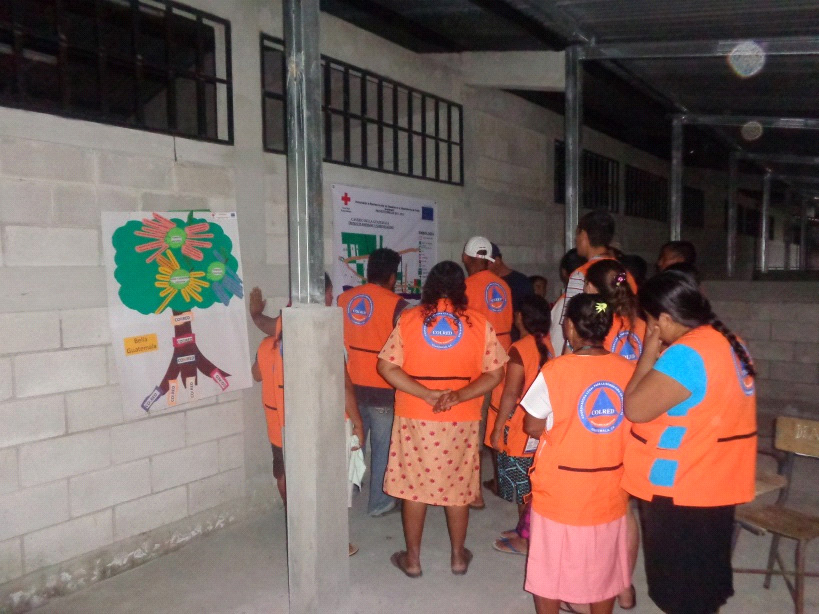
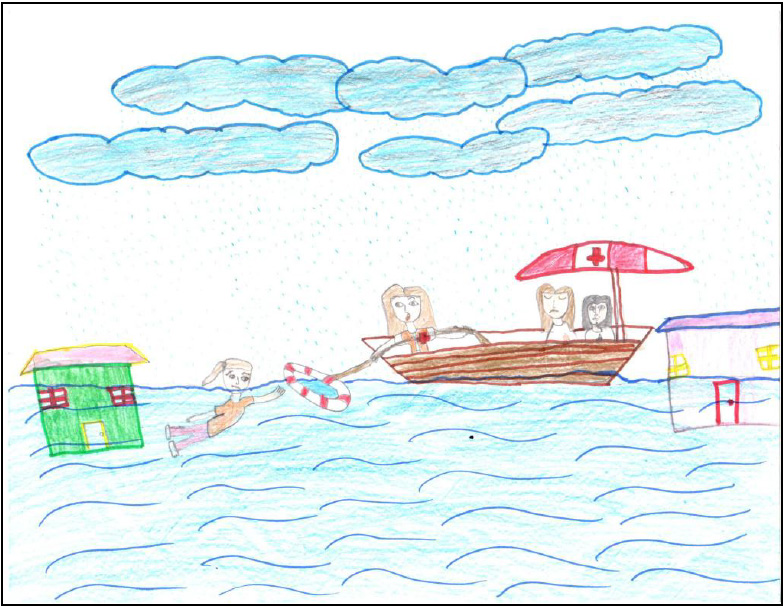

#DIPECHO VIII
- - - - - - - - - - - - - - - - - - - - - - - - - - - - - - - - - - -

##Detalles del Proyecto
| Descripción         | Detalle   |
|:--------------------|:---------:|
| Nombre del proyecto | Aumentando la resiliencia ante los desastres en el departamento del Peten, Guatemala |
| Donante             | ECHO |
| Presupuesto total   | 628,294.00€ |
| Año de ejecución    | 2012 - 2013 |
| Tiempo de ejecución | 18 meses (01/07/2012 al 31/12/2013) |

La Cruz Roja Guatemalteca, en consorcio con Cruz Roja Holandesa, Cruz Roja Noruega y Cruz Roja Española ejecutó durante 18 meses el proyecto DIPECHO VIII “Aumentando la resiliencia ante los desastre en el departamento de Petén, Guatemala” en el municipio de Las Cruces, en 10  comunidades rurales y en el casco urbano del municipio. El objetivo del proyecto fue reducir el alto riesgo de desastres de la zona, debido a una combinación de amenazas existentes entre inundaciones, vulnerabilidad ambiental , social , organizativo , económico y educativo de alto nivel, y la insuficiente capacidad institucional para la prevención , preparación y respuesta a los desastres a nivel municipal y departamental. Para llevarlo a cabo el proyecto, entre otras actividades que logró ejecutar con éxito: mejoró el conocimiento de la población beneficiaria sobre desastres, salud en emergencias y del sistema de alertas de acuerdo a los colores que se emiten; se conformaron a las COLRED equipándolas y acreditándolas; en relación a los albergues se dotó de un kit individual familiar a las personas que se asentaban en las comunidades de mayor riesgo y se mejoró la infraestructura en aquellas comunidades que contaban con espacios físicos utilizables para tal fin; se trabajó en escuelas creando estructuras organizativas para la respuesta a desastres; se actualizaron los Planes Institucionales de Respuesta y a nivel municipal se creó una partida presupuestaria, de los ingresos ordinarios de la municipalidad, para la atención de contingencias generadas por desastres.

##Ubicación
[gimmick:googlemaps(zoom: 10, marker: 'true')](Sayaxché, Petén)
###Departamento
* Petén
####Municipio
* Las Cruces
* Sayaxché

##Objetivos

###Objetivo General
Reducir el impacto de futuros desastres en comunidades vulnerables de Guatemala

###Objetivo Específico
1. Aumentada la resiliencia a desastres y reducida a vulnerabilidad de población rural y urbana en el Departamento de Petén

##Beneficiarios
| Descripción                     | Detalle |
|:--------------------------------|:-------:|
| N° beneficiarios directos       | 21366 |
| % hombres                       | 52% |
| % mujeres                       | 48% |
| N° de comunidades beneficiarias | 10 |
| Etnia                           | Mestiza en su mayoría |

##Documentos
###Informes
####Final

<a class="descarga-pdf" href="p13-dipecho8/2-informes/informe_final.pdf">Descargar</a>

#####Final Report

<a class="descarga-pdf" href="p13-dipecho8/2-informes/final_report_dipecho_viii.pdf">Descargar</a>

###Sistematizaciónes

<a class="descarga-pdf" href="p13-dipecho8/2-informes/informe_sistematizacion_dipecho_viii.pdf">Descargar</a>

##Fotos

###SD

- - - - - - - - - - - - - - - - - - - - - - - - - - - - - - - - - - -

[p01]: proyectos/p01.md	"Programa para el Desarrollo"
[p02]: proyectos/p02.md	"Cooperación Holandesa para Ayuda en Centroamérica -CHACA-"
[p03]: proyectos/p03.md	"Atención a la salud preventiva, agua y saneamiento en 12 comunidades de Alta Verapaz, Guatemala"
[p04]: proyectos/p04.md	"Fortalecimiento de las Capacidades para la mitigación de desastres en el Municipio de Cobán y 30 comunidades de la cuenca del Río Chixoy"
[p05]: proyectos/p05.md	"Reduciendo los Riesgos en Comunidades Vulnerables del  Municipio de Santo Domingo, Departamento de Suchitepéquez, Guatemala"
[p06]: proyectos/p06.md	"Fortaleciendo capacidades ante los riesgos de Cambio Climático en el Oriente de Guatemala"
[p07]: proyectos/p07.md	"Reducción de Vulnerabilidades ante los efectos del Cambio Climático en Guatemala, Fase II"
[p08]: proyectos/p08.md	"Trabajando juntos podemos reducir los riesgos en las comunidades vulnerables de Champerico y Retalhuleu, Guatemala"
[p09]: proyectos/p09.md	"Respuesta inmediata ante las inundaciones provocadas por la Tormenta AGATHA, en la región suroccidente de Guatemala"
[p10]: proyectos/p10.md	"Fortaleciendo la Resiliencia de las comunidades ante los efectos de los desastres en parcelamiento La Máquina, Suchitepéquez y Retalhuleu"
[p11]: proyectos/p11.md	"Reducción del riesgo de desastres incrementados por el Cambio Climático"
[p12]: proyectos/p12.md	"Respuesta Inmediata a los efectos de los sismos en el departamento de Santa Rosa, Guatemala"
[p13]: proyectos/p13.md	"Aumentando la resiliencia ante los desastres en el departamento del Peten, Guatemala"
[p14]: proyectos/p14.md	"Mejorando la Salud Materno Neonatal de Comunidades Vulnerables de San Marcos, Guatemala"

