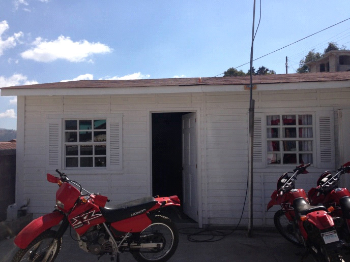
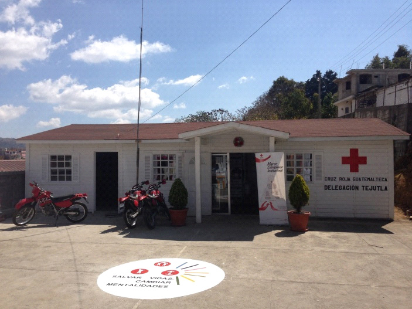
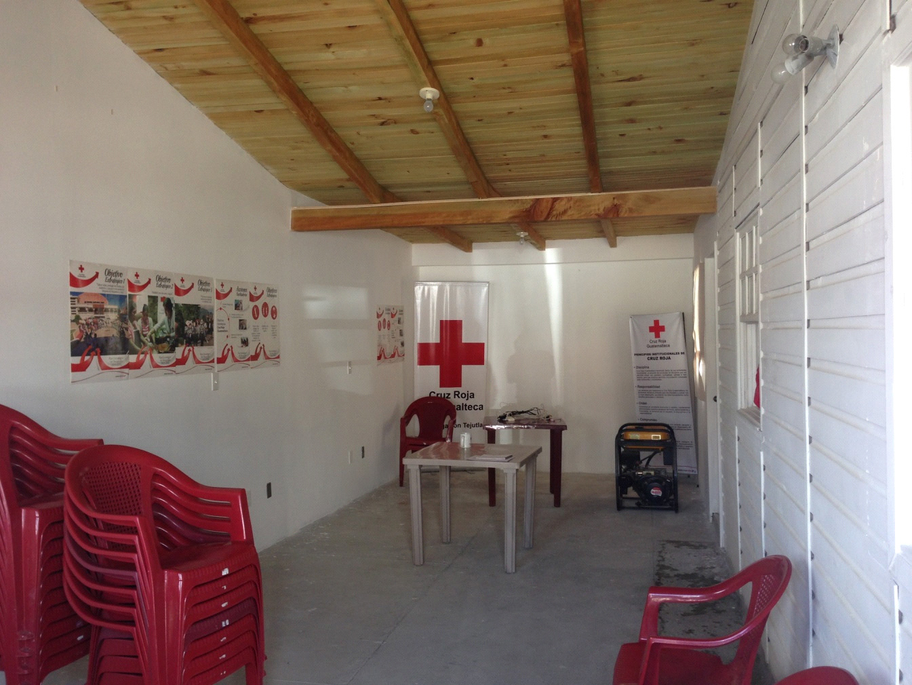

#SAMN
- - - - - - - - - - - - - - - - - - - - - - - - - - - - - - - - - - -

##Detalles del Proyecto
| Descripción         | Detalle   |
|:--------------------|:---------:|
| Nombre del proyecto | Mejorando la Salud Materno Neonatal de Comunidades Vulnerables de San Marcos, Guatemala |
| Donante             | Fondos Propios CRH |
| Presupuesto total   | 618,216.79€ |
| Año de ejecución    | 2013 - 2014 |
| Tiempo de ejecución | 24 meses |

##Antecedentes
El Proyecto “Mejorando la Salud en Comunidades Vulnerables del departamento de San Marcos”, tuvo como objetivo contribuir en la reducción de la muerte materna y neonatal en este departamento.  Se trabajó en 32 comunidades donde hubo un total de 27,009  beneficiarios, con 10,133 mujeres embarazadas y madres de menores de un año, 7,545 recién nacidos y menores de un año,  4,950 mujeres en edad fértil, 4,100 Hombres de 15 a 49 años y 281 líderes comunitarios. Para poder alcanzar el objetivo del proyecto se contó con el gran apoyo de 20 Voluntarias y 23 Voluntarios de Cruz Roja Guatemalteca que aportaron con su tiempo, conocimientos y sobre todo voluntad para apoyar y generar cambios positivos en la vida de muchas familias. El proyecto apoyó al proceso de incidencia desarrollado por las Delegaciones de Cruz Roja Guatemalteca en los Órganos Municipales de Coordinación que las Delegaciones de Cruz Roja Guatemalteca han trabajado en el desarrollo de acciones que incluyeron la promoción de la vida saludable a través de organización de comisiones de salud, participación en ferias de la salud, organización de eventos para luchar en contra de la desnutrición infantil hasta lograr la realización de Dos Planes Municipales de Salud (PMS) en Comitancillo y Tejutla. La coordinación y trabajo en equipo desarrollado con autoridades y personal del Ministerio de Salud, y el trabajo que realizaron los Voluntarios de la Cruz Roja Guatemalteca dentro de los servicios de salud, brindando consejería a mujeres embarazadas asistentes a su control prenatal, consejería a mujeres en el preparto y postparto y en la conducción de grupos de apoyo a madres, fueron parte de las acciones desarrolladas para el éxito del proyecto en los 24 meses que tuvo de duración.

##Ubicación
[gimmick:googlemaps(zoom: 10, marker: 'true')](Tejutla, San Marcos)
###Departamento
* San Marcos
####Municipio
* San Marcos
* Comitancillo
* Tejutla

##Objetivos

###Objetivo General
Contribuir a la reducción de la mortalidad materna y neonatal en el departamento de San Marcos, Guatemala..

###Objetivo Específico
Mujeres embarazadas y recién nacidos han mejorado su salud materno neonatal en las comunidades atendidas del departamento de San Marcos

##Beneficiarios
| Descripción                     | Detalle |
|:--------------------------------|:-------:|
| Mujeres embarazadas y madres de menores de un año | 10,133 |
| Recién nacidos y menores de un año | 7,545 |
| Mujeres en edad fértil | 4,950 |
| Hombres de 15 a 49 años | 4,100 |
| Líderes comunitarios | 281 |
| N° total de beneficiarios directos | 27,009 |
| N° de comunidades beneficiarias | 32	|
| Etnia                           | Mestiza y Mam |

##Documentos
###Informes
####Narrative Report

<a class="descarga-pdf" href="p14-samn/2-informes/narrative_report_20130731.pdf">Descargar</a>

####Semestrales
#####Segundo Semestre 2013

<a class="descarga-pdf" href="p14-samn/2-informes/informe_semestral_samn_20140126.pdf">Descargar</a>

#####Primer Semestre 2014

<a class="descarga-pdf" href="p14-samn/2-informes/informe_semestral_samn_20140630.pdf">Descargar</a>

##Fotos
###HD

- - -

##Videos
#### Documental sobre Salud Materno-Infantil - San Marcos

[Descargar MP4](p14-samn/5-herramientas/documental_materno_infantil_san_marcos_hd.mp4 "Documental sobre Salud Materno-Infantil - San Marcos") | [Descargar WEBM](p14-samn/5-herramientas/documental_materno_infantil_san_marcos_hd.webm "Documental sobre Salud Materno-Infantil - San Marcos")

- - - - - - - - - - - - - - - - - - - - - - - - - - - - - - - - - - -

[p01]: proyectos/p01.md	"Programa para el Desarrollo"
[p02]: proyectos/p02.md	"Cooperación Holandesa para Ayuda en Centroamérica -CHACA-"
[p03]: proyectos/p03.md	"Atención a la salud preventiva, agua y saneamiento en 12 comunidades de Alta Verapaz, Guatemala"
[p04]: proyectos/p04.md	"Fortalecimiento de las Capacidades para la mitigación de desastres en el Municipio de Cobán y 30 comunidades de la cuenca del Río Chixoy"
[p05]: proyectos/p05.md	"Reduciendo los Riesgos en Comunidades Vulnerables del  Municipio de Santo Domingo, Departamento de Suchitepéquez, Guatemala"
[p06]: proyectos/p06.md	"Fortaleciendo capacidades ante los riesgos de Cambio Climático en el Oriente de Guatemala"
[p07]: proyectos/p07.md	"Reducción de Vulnerabilidades ante los efectos del Cambio Climático en Guatemala, Fase II"
[p08]: proyectos/p08.md	"Trabajando juntos podemos reducir los riesgos en las comunidades vulnerables de Champerico y Retalhuleu, Guatemala"
[p09]: proyectos/p09.md	"Respuesta inmediata ante las inundaciones provocadas por la Tormenta AGATHA, en la región suroccidente de Guatemala"
[p10]: proyectos/p10.md	"Fortaleciendo la Resiliencia de las comunidades ante los efectos de los desastres en parcelamiento La Máquina, Suchitepéquez y Retalhuleu"
[p11]: proyectos/p11.md	"Reducción del riesgo de desastres incrementados por el Cambio Climático"
[p12]: proyectos/p12.md	"Respuesta Inmediata a los efectos de los sismos en el departamento de Santa Rosa, Guatemala"
[p13]: proyectos/p13.md	"Aumentando la resiliencia ante los desastres en el departamento del Peten, Guatemala"
[p14]: proyectos/p14.md	"Mejorando la Salud Materno Neonatal de Comunidades Vulnerables de San Marcos, Guatemala"

